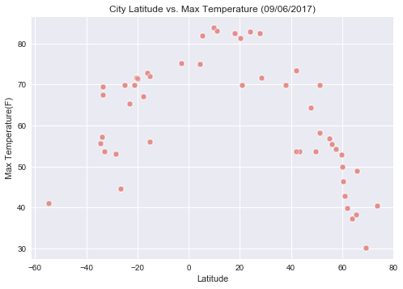
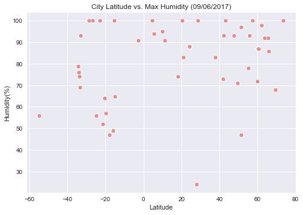
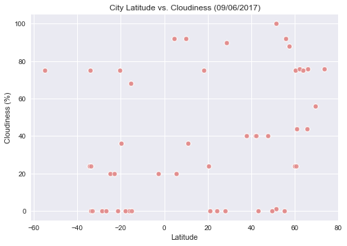
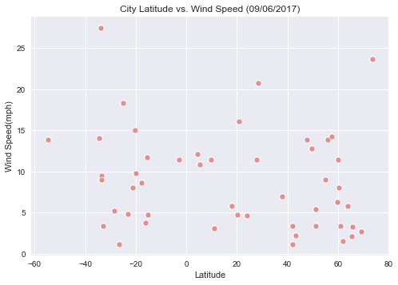

```python
# Assignment 5 - What's the Weather like?

# test file used to import and get the city data

#call citipy function select city.


#import library
#Utilize  citypy [simple Python library](https://pypi.python.org/pypi/citipy)

import pandas as pd
import matplotlib.pyplot as plt
import numpy as np
import random
import seaborn as sns
import citipy 
import json
import requests as req
from citipy import citipy

```


```python
#Use current weather data from the [openWeatherMap API](https://openweathermap.org/api)
# Perform a weather check on each of the cities 
# using a series of successive API calls. 
sample_city=[]
query_url =[]

for y in range (0,30):
    y = y +1
    for x in range (0, 50):
        #Set the weather API keys
        # Save config information.

        # longitude is from -90 to 90, lattitude is from -90 to 90

        city = citipy.nearest_city(random.uniform(-90, 90), random.uniform(-90, 90))
                # print(city.city_name)
        new_city = city.city_name
        new_city = new_city.replace(" ", "")
        if new_city not in sample_city:
            sample_city.append(new_city)
        else: 
            x = x-1
print(len(sample_city))
# created list of sample cities to select from          
    
```

    600


```python
for y in range (0,15):
    for x in range (0,50):
        api_key = "1d8c2c04ac4392e29642794565ff69bf"
        url = "http://api.openweathermap.org/data/2.5/weather?"
        city = sample_city[x]
        
        units = "imperial"
            # Build partial query URL
        new_url = url + "appid=" + api_key + "&units=" + units + "&q="+city
        print("Proscessing Record %s of Set %s | %s" % ((x+1) , y+1, city) )
        print(new_url)
        query_url.append(new_url)
    x=0

```

    Proscessing Record 1 of Set 1 | portalfred
    http://api.openweathermap.org/data/2.5/weather?appid=1d8c2c04ac4392e29642794565ff69bf&units=imperial&q=portalfred
    Proscessing Record 2 of Set 1 | hermanus
    http://api.openweathermap.org/data/2.5/weather?appid=1d8c2c04ac4392e29642794565ff69bf&units=imperial&q=hermanus
    Proscessing Record 3 of Set 1 | saint-philippe
    http://api.openweathermap.org/data/2.5/weather?appid=1d8c2c04ac4392e29642794565ff69bf&units=imperial&q=saint-philippe
    Proscessing Record 4 of Set 1 | capetown
    http://api.openweathermap.org/data/2.5/weather?appid=1d8c2c04ac4392e29642794565ff69bf&units=imperial&q=capetown
    Proscessing Record 5 of Set 1 | illoqqortoormiut
    http://api.openweathermap.org/data/2.5/weather?appid=1d8c2c04ac4392e29642794565ff69bf&units=imperial&q=illoqqortoormiut
    Proscessing Record 6 of Set 1 | ribeiragrande
    http://api.openweathermap.org/data/2.5/weather?appid=1d8c2c04ac4392e29642794565ff69bf&units=imperial&q=ribeiragrande
    Proscessing Record 7 of Set 1 | ushuaia
    http://api.openweathermap.org/data/2.5/weather?appid=1d8c2c04ac4392e29642794565ff69bf&units=imperial&q=ushuaia
    Proscessing Record 8 of Set 1 | carballo
    http://api.openweathermap.org/data/2.5/weather?appid=1d8c2c04ac4392e29642794565ff69bf&units=imperial&q=carballo
    Proscessing Record 9 of Set 1 | kalachinsk
    http://api.openweathermap.org/data/2.5/weather?appid=1d8c2c04ac4392e29642794565ff69bf&units=imperial&q=kalachinsk
    Proscessing Record 10 of Set 1 | busselton
    http://api.openweathermap.org/data/2.5/weather?appid=1d8c2c04ac4392e29642794565ff69bf&units=imperial&q=busselton
    Proscessing Record 11 of Set 1 | ilulissat
    http://api.openweathermap.org/data/2.5/weather?appid=1d8c2c04ac4392e29642794565ff69bf&units=imperial&q=ilulissat
    Proscessing Record 12 of Set 1 | nouadhibou
    http://api.openweathermap.org/data/2.5/weather?appid=1d8c2c04ac4392e29642794565ff69bf&units=imperial&q=nouadhibou
    Proscessing Record 13 of Set 1 | souillac
    http://api.openweathermap.org/data/2.5/weather?appid=1d8c2c04ac4392e29642794565ff69bf&units=imperial&q=souillac
    Proscessing Record 14 of Set 1 | oranjemund
    http://api.openweathermap.org/data/2.5/weather?appid=1d8c2c04ac4392e29642794565ff69bf&units=imperial&q=oranjemund
    Proscessing Record 15 of Set 1 | bambousvirieux
    http://api.openweathermap.org/data/2.5/weather?appid=1d8c2c04ac4392e29642794565ff69bf&units=imperial&q=bambousvirieux
    Proscessing Record 16 of Set 1 | mayorpablolagerenza
    http://api.openweathermap.org/data/2.5/weather?appid=1d8c2c04ac4392e29642794565ff69bf&units=imperial&q=mayorpablolagerenza
    Proscessing Record 17 of Set 1 | jamestown
    http://api.openweathermap.org/data/2.5/weather?appid=1d8c2c04ac4392e29642794565ff69bf&units=imperial&q=jamestown
    Proscessing Record 18 of Set 1 | sinnamary
    http://api.openweathermap.org/data/2.5/weather?appid=1d8c2c04ac4392e29642794565ff69bf&units=imperial&q=sinnamary
    Proscessing Record 19 of Set 1 | santacruzdetenerife
    http://api.openweathermap.org/data/2.5/weather?appid=1d8c2c04ac4392e29642794565ff69bf&units=imperial&q=santacruzdetenerife
    Proscessing Record 20 of Set 1 | eastlondon
    http://api.openweathermap.org/data/2.5/weather?appid=1d8c2c04ac4392e29642794565ff69bf&units=imperial&q=eastlondon
    Proscessing Record 21 of Set 1 | narsaq
    http://api.openweathermap.org/data/2.5/weather?appid=1d8c2c04ac4392e29642794565ff69bf&units=imperial&q=narsaq
    Proscessing Record 22 of Set 1 | marcona
    http://api.openweathermap.org/data/2.5/weather?appid=1d8c2c04ac4392e29642794565ff69bf&units=imperial&q=marcona
    Proscessing Record 23 of Set 1 | oparino
    http://api.openweathermap.org/data/2.5/weather?appid=1d8c2c04ac4392e29642794565ff69bf&units=imperial&q=oparino
    Proscessing Record 24 of Set 1 | taolanaro
    http://api.openweathermap.org/data/2.5/weather?appid=1d8c2c04ac4392e29642794565ff69bf&units=imperial&q=taolanaro
    Proscessing Record 25 of Set 1 | manzanillo
    http://api.openweathermap.org/data/2.5/weather?appid=1d8c2c04ac4392e29642794565ff69bf&units=imperial&q=manzanillo
    Proscessing Record 26 of Set 1 | pointpedro
    http://api.openweathermap.org/data/2.5/weather?appid=1d8c2c04ac4392e29642794565ff69bf&units=imperial&q=pointpedro
    Proscessing Record 27 of Set 1 | pedernales
    http://api.openweathermap.org/data/2.5/weather?appid=1d8c2c04ac4392e29642794565ff69bf&units=imperial&q=pedernales
    Proscessing Record 28 of Set 1 | thyolo
    http://api.openweathermap.org/data/2.5/weather?appid=1d8c2c04ac4392e29642794565ff69bf&units=imperial&q=thyolo
    Proscessing Record 29 of Set 1 | arraialdocabo
    http://api.openweathermap.org/data/2.5/weather?appid=1d8c2c04ac4392e29642794565ff69bf&units=imperial&q=arraialdocabo
    Proscessing Record 30 of Set 1 | tarbert
    http://api.openweathermap.org/data/2.5/weather?appid=1d8c2c04ac4392e29642794565ff69bf&units=imperial&q=tarbert
    Proscessing Record 31 of Set 1 | ongandjera
    http://api.openweathermap.org/data/2.5/weather?appid=1d8c2c04ac4392e29642794565ff69bf&units=imperial&q=ongandjera
    Proscessing Record 32 of Set 1 | lgov
    http://api.openweathermap.org/data/2.5/weather?appid=1d8c2c04ac4392e29642794565ff69bf&units=imperial&q=lgov
    Proscessing Record 33 of Set 1 | maniitsoq
    http://api.openweathermap.org/data/2.5/weather?appid=1d8c2c04ac4392e29642794565ff69bf&units=imperial&q=maniitsoq
    Proscessing Record 34 of Set 1 | cochrane
    http://api.openweathermap.org/data/2.5/weather?appid=1d8c2c04ac4392e29642794565ff69bf&units=imperial&q=cochrane
    Proscessing Record 35 of Set 1 | saint-augustin
    http://api.openweathermap.org/data/2.5/weather?appid=1d8c2c04ac4392e29642794565ff69bf&units=imperial&q=saint-augustin
    Proscessing Record 36 of Set 1 | dikson
    http://api.openweathermap.org/data/2.5/weather?appid=1d8c2c04ac4392e29642794565ff69bf&units=imperial&q=dikson
    Proscessing Record 37 of Set 1 | mezen
    http://api.openweathermap.org/data/2.5/weather?appid=1d8c2c04ac4392e29642794565ff69bf&units=imperial&q=mezen
    Proscessing Record 38 of Set 1 | torbay
    http://api.openweathermap.org/data/2.5/weather?appid=1d8c2c04ac4392e29642794565ff69bf&units=imperial&q=torbay
    Proscessing Record 39 of Set 1 | machinga
    http://api.openweathermap.org/data/2.5/weather?appid=1d8c2c04ac4392e29642794565ff69bf&units=imperial&q=machinga
    Proscessing Record 40 of Set 1 | adrar
    http://api.openweathermap.org/data/2.5/weather?appid=1d8c2c04ac4392e29642794565ff69bf&units=imperial&q=adrar
    Proscessing Record 41 of Set 1 | dingle
    http://api.openweathermap.org/data/2.5/weather?appid=1d8c2c04ac4392e29642794565ff69bf&units=imperial&q=dingle
    Proscessing Record 42 of Set 1 | itarema
    http://api.openweathermap.org/data/2.5/weather?appid=1d8c2c04ac4392e29642794565ff69bf&units=imperial&q=itarema
    Proscessing Record 43 of Set 1 | grandriversoutheast
    http://api.openweathermap.org/data/2.5/weather?appid=1d8c2c04ac4392e29642794565ff69bf&units=imperial&q=grandriversoutheast
    Proscessing Record 44 of Set 1 | paamiut
    http://api.openweathermap.org/data/2.5/weather?appid=1d8c2c04ac4392e29642794565ff69bf&units=imperial&q=paamiut
    Proscessing Record 45 of Set 1 | khedbrahma
    http://api.openweathermap.org/data/2.5/weather?appid=1d8c2c04ac4392e29642794565ff69bf&units=imperial&q=khedbrahma
    Proscessing Record 46 of Set 1 | luderitz
    http://api.openweathermap.org/data/2.5/weather?appid=1d8c2c04ac4392e29642794565ff69bf&units=imperial&q=luderitz
    Proscessing Record 47 of Set 1 | pacov
    http://api.openweathermap.org/data/2.5/weather?appid=1d8c2c04ac4392e29642794565ff69bf&units=imperial&q=pacov
    Proscessing Record 48 of Set 1 | portree
    http://api.openweathermap.org/data/2.5/weather?appid=1d8c2c04ac4392e29642794565ff69bf&units=imperial&q=portree
    Proscessing Record 49 of Set 1 | iqaluit
    http://api.openweathermap.org/data/2.5/weather?appid=1d8c2c04ac4392e29642794565ff69bf&units=imperial&q=iqaluit
    Proscessing Record 50 of Set 1 | harper
    http://api.openweathermap.org/data/2.5/weather?appid=1d8c2c04ac4392e29642794565ff69bf&units=imperial&q=harper
    Proscessing Record 1 of Set 2 | portalfred
    http://api.openweathermap.org/data/2.5/weather?appid=1d8c2c04ac4392e29642794565ff69bf&units=imperial&q=portalfred
    Proscessing Record 2 of Set 2 | hermanus
    http://api.openweathermap.org/data/2.5/weather?appid=1d8c2c04ac4392e29642794565ff69bf&units=imperial&q=hermanus
    Proscessing Record 3 of Set 2 | saint-philippe
    http://api.openweathermap.org/data/2.5/weather?appid=1d8c2c04ac4392e29642794565ff69bf&units=imperial&q=saint-philippe
    Proscessing Record 4 of Set 2 | capetown
    http://api.openweathermap.org/data/2.5/weather?appid=1d8c2c04ac4392e29642794565ff69bf&units=imperial&q=capetown
    Proscessing Record 5 of Set 2 | illoqqortoormiut
    http://api.openweathermap.org/data/2.5/weather?appid=1d8c2c04ac4392e29642794565ff69bf&units=imperial&q=illoqqortoormiut
    Proscessing Record 6 of Set 2 | ribeiragrande
    http://api.openweathermap.org/data/2.5/weather?appid=1d8c2c04ac4392e29642794565ff69bf&units=imperial&q=ribeiragrande
    Proscessing Record 7 of Set 2 | ushuaia
    http://api.openweathermap.org/data/2.5/weather?appid=1d8c2c04ac4392e29642794565ff69bf&units=imperial&q=ushuaia
    Proscessing Record 8 of Set 2 | carballo
    http://api.openweathermap.org/data/2.5/weather?appid=1d8c2c04ac4392e29642794565ff69bf&units=imperial&q=carballo
    Proscessing Record 9 of Set 2 | kalachinsk
    http://api.openweathermap.org/data/2.5/weather?appid=1d8c2c04ac4392e29642794565ff69bf&units=imperial&q=kalachinsk
    Proscessing Record 10 of Set 2 | busselton
    http://api.openweathermap.org/data/2.5/weather?appid=1d8c2c04ac4392e29642794565ff69bf&units=imperial&q=busselton
    Proscessing Record 11 of Set 2 | ilulissat
    http://api.openweathermap.org/data/2.5/weather?appid=1d8c2c04ac4392e29642794565ff69bf&units=imperial&q=ilulissat
    Proscessing Record 12 of Set 2 | nouadhibou
    http://api.openweathermap.org/data/2.5/weather?appid=1d8c2c04ac4392e29642794565ff69bf&units=imperial&q=nouadhibou
    Proscessing Record 13 of Set 2 | souillac
    http://api.openweathermap.org/data/2.5/weather?appid=1d8c2c04ac4392e29642794565ff69bf&units=imperial&q=souillac
    Proscessing Record 14 of Set 2 | oranjemund
    http://api.openweathermap.org/data/2.5/weather?appid=1d8c2c04ac4392e29642794565ff69bf&units=imperial&q=oranjemund
    Proscessing Record 15 of Set 2 | bambousvirieux
    http://api.openweathermap.org/data/2.5/weather?appid=1d8c2c04ac4392e29642794565ff69bf&units=imperial&q=bambousvirieux
    Proscessing Record 16 of Set 2 | mayorpablolagerenza
    http://api.openweathermap.org/data/2.5/weather?appid=1d8c2c04ac4392e29642794565ff69bf&units=imperial&q=mayorpablolagerenza
    Proscessing Record 17 of Set 2 | jamestown
    http://api.openweathermap.org/data/2.5/weather?appid=1d8c2c04ac4392e29642794565ff69bf&units=imperial&q=jamestown
    Proscessing Record 18 of Set 2 | sinnamary
    http://api.openweathermap.org/data/2.5/weather?appid=1d8c2c04ac4392e29642794565ff69bf&units=imperial&q=sinnamary
    Proscessing Record 19 of Set 2 | santacruzdetenerife
    http://api.openweathermap.org/data/2.5/weather?appid=1d8c2c04ac4392e29642794565ff69bf&units=imperial&q=santacruzdetenerife
    Proscessing Record 20 of Set 2 | eastlondon
    http://api.openweathermap.org/data/2.5/weather?appid=1d8c2c04ac4392e29642794565ff69bf&units=imperial&q=eastlondon
    Proscessing Record 21 of Set 2 | narsaq
    http://api.openweathermap.org/data/2.5/weather?appid=1d8c2c04ac4392e29642794565ff69bf&units=imperial&q=narsaq
    Proscessing Record 22 of Set 2 | marcona
    http://api.openweathermap.org/data/2.5/weather?appid=1d8c2c04ac4392e29642794565ff69bf&units=imperial&q=marcona
    Proscessing Record 23 of Set 2 | oparino
    http://api.openweathermap.org/data/2.5/weather?appid=1d8c2c04ac4392e29642794565ff69bf&units=imperial&q=oparino
    Proscessing Record 24 of Set 2 | taolanaro
    http://api.openweathermap.org/data/2.5/weather?appid=1d8c2c04ac4392e29642794565ff69bf&units=imperial&q=taolanaro
    Proscessing Record 25 of Set 2 | manzanillo
    http://api.openweathermap.org/data/2.5/weather?appid=1d8c2c04ac4392e29642794565ff69bf&units=imperial&q=manzanillo
    Proscessing Record 26 of Set 2 | pointpedro
    http://api.openweathermap.org/data/2.5/weather?appid=1d8c2c04ac4392e29642794565ff69bf&units=imperial&q=pointpedro
    Proscessing Record 27 of Set 2 | pedernales
    http://api.openweathermap.org/data/2.5/weather?appid=1d8c2c04ac4392e29642794565ff69bf&units=imperial&q=pedernales
    Proscessing Record 28 of Set 2 | thyolo
    http://api.openweathermap.org/data/2.5/weather?appid=1d8c2c04ac4392e29642794565ff69bf&units=imperial&q=thyolo
    Proscessing Record 29 of Set 2 | arraialdocabo
    http://api.openweathermap.org/data/2.5/weather?appid=1d8c2c04ac4392e29642794565ff69bf&units=imperial&q=arraialdocabo
    Proscessing Record 30 of Set 2 | tarbert
    http://api.openweathermap.org/data/2.5/weather?appid=1d8c2c04ac4392e29642794565ff69bf&units=imperial&q=tarbert
    Proscessing Record 31 of Set 2 | ongandjera
    http://api.openweathermap.org/data/2.5/weather?appid=1d8c2c04ac4392e29642794565ff69bf&units=imperial&q=ongandjera
    Proscessing Record 32 of Set 2 | lgov
    http://api.openweathermap.org/data/2.5/weather?appid=1d8c2c04ac4392e29642794565ff69bf&units=imperial&q=lgov
    Proscessing Record 33 of Set 2 | maniitsoq
    http://api.openweathermap.org/data/2.5/weather?appid=1d8c2c04ac4392e29642794565ff69bf&units=imperial&q=maniitsoq
    Proscessing Record 34 of Set 2 | cochrane
    http://api.openweathermap.org/data/2.5/weather?appid=1d8c2c04ac4392e29642794565ff69bf&units=imperial&q=cochrane
    Proscessing Record 35 of Set 2 | saint-augustin
    http://api.openweathermap.org/data/2.5/weather?appid=1d8c2c04ac4392e29642794565ff69bf&units=imperial&q=saint-augustin
    Proscessing Record 36 of Set 2 | dikson
    http://api.openweathermap.org/data/2.5/weather?appid=1d8c2c04ac4392e29642794565ff69bf&units=imperial&q=dikson
    Proscessing Record 37 of Set 2 | mezen
    http://api.openweathermap.org/data/2.5/weather?appid=1d8c2c04ac4392e29642794565ff69bf&units=imperial&q=mezen
    Proscessing Record 38 of Set 2 | torbay
    http://api.openweathermap.org/data/2.5/weather?appid=1d8c2c04ac4392e29642794565ff69bf&units=imperial&q=torbay
    Proscessing Record 39 of Set 2 | machinga
    http://api.openweathermap.org/data/2.5/weather?appid=1d8c2c04ac4392e29642794565ff69bf&units=imperial&q=machinga
    Proscessing Record 40 of Set 2 | adrar
    http://api.openweathermap.org/data/2.5/weather?appid=1d8c2c04ac4392e29642794565ff69bf&units=imperial&q=adrar
    Proscessing Record 41 of Set 2 | dingle
    http://api.openweathermap.org/data/2.5/weather?appid=1d8c2c04ac4392e29642794565ff69bf&units=imperial&q=dingle
    Proscessing Record 42 of Set 2 | itarema
    http://api.openweathermap.org/data/2.5/weather?appid=1d8c2c04ac4392e29642794565ff69bf&units=imperial&q=itarema
    Proscessing Record 43 of Set 2 | grandriversoutheast
    http://api.openweathermap.org/data/2.5/weather?appid=1d8c2c04ac4392e29642794565ff69bf&units=imperial&q=grandriversoutheast
    Proscessing Record 44 of Set 2 | paamiut
    http://api.openweathermap.org/data/2.5/weather?appid=1d8c2c04ac4392e29642794565ff69bf&units=imperial&q=paamiut
    Proscessing Record 45 of Set 2 | khedbrahma
    http://api.openweathermap.org/data/2.5/weather?appid=1d8c2c04ac4392e29642794565ff69bf&units=imperial&q=khedbrahma
    Proscessing Record 46 of Set 2 | luderitz
    http://api.openweathermap.org/data/2.5/weather?appid=1d8c2c04ac4392e29642794565ff69bf&units=imperial&q=luderitz
    Proscessing Record 47 of Set 2 | pacov
    http://api.openweathermap.org/data/2.5/weather?appid=1d8c2c04ac4392e29642794565ff69bf&units=imperial&q=pacov
    Proscessing Record 48 of Set 2 | portree
    http://api.openweathermap.org/data/2.5/weather?appid=1d8c2c04ac4392e29642794565ff69bf&units=imperial&q=portree
    Proscessing Record 49 of Set 2 | iqaluit
    http://api.openweathermap.org/data/2.5/weather?appid=1d8c2c04ac4392e29642794565ff69bf&units=imperial&q=iqaluit
    Proscessing Record 50 of Set 2 | harper
    http://api.openweathermap.org/data/2.5/weather?appid=1d8c2c04ac4392e29642794565ff69bf&units=imperial&q=harper
    Proscessing Record 1 of Set 3 | portalfred
    http://api.openweathermap.org/data/2.5/weather?appid=1d8c2c04ac4392e29642794565ff69bf&units=imperial&q=portalfred
    Proscessing Record 2 of Set 3 | hermanus
    http://api.openweathermap.org/data/2.5/weather?appid=1d8c2c04ac4392e29642794565ff69bf&units=imperial&q=hermanus
    Proscessing Record 3 of Set 3 | saint-philippe
    http://api.openweathermap.org/data/2.5/weather?appid=1d8c2c04ac4392e29642794565ff69bf&units=imperial&q=saint-philippe
    Proscessing Record 4 of Set 3 | capetown
    http://api.openweathermap.org/data/2.5/weather?appid=1d8c2c04ac4392e29642794565ff69bf&units=imperial&q=capetown
    Proscessing Record 5 of Set 3 | illoqqortoormiut
    http://api.openweathermap.org/data/2.5/weather?appid=1d8c2c04ac4392e29642794565ff69bf&units=imperial&q=illoqqortoormiut
    Proscessing Record 6 of Set 3 | ribeiragrande
    http://api.openweathermap.org/data/2.5/weather?appid=1d8c2c04ac4392e29642794565ff69bf&units=imperial&q=ribeiragrande
    Proscessing Record 7 of Set 3 | ushuaia
    http://api.openweathermap.org/data/2.5/weather?appid=1d8c2c04ac4392e29642794565ff69bf&units=imperial&q=ushuaia
    Proscessing Record 8 of Set 3 | carballo
    http://api.openweathermap.org/data/2.5/weather?appid=1d8c2c04ac4392e29642794565ff69bf&units=imperial&q=carballo
    Proscessing Record 9 of Set 3 | kalachinsk
    http://api.openweathermap.org/data/2.5/weather?appid=1d8c2c04ac4392e29642794565ff69bf&units=imperial&q=kalachinsk
    Proscessing Record 10 of Set 3 | busselton
    http://api.openweathermap.org/data/2.5/weather?appid=1d8c2c04ac4392e29642794565ff69bf&units=imperial&q=busselton
    Proscessing Record 11 of Set 3 | ilulissat
    http://api.openweathermap.org/data/2.5/weather?appid=1d8c2c04ac4392e29642794565ff69bf&units=imperial&q=ilulissat
    Proscessing Record 12 of Set 3 | nouadhibou
    http://api.openweathermap.org/data/2.5/weather?appid=1d8c2c04ac4392e29642794565ff69bf&units=imperial&q=nouadhibou
    Proscessing Record 13 of Set 3 | souillac
    http://api.openweathermap.org/data/2.5/weather?appid=1d8c2c04ac4392e29642794565ff69bf&units=imperial&q=souillac
    Proscessing Record 14 of Set 3 | oranjemund
    http://api.openweathermap.org/data/2.5/weather?appid=1d8c2c04ac4392e29642794565ff69bf&units=imperial&q=oranjemund
    Proscessing Record 15 of Set 3 | bambousvirieux
    http://api.openweathermap.org/data/2.5/weather?appid=1d8c2c04ac4392e29642794565ff69bf&units=imperial&q=bambousvirieux
    Proscessing Record 16 of Set 3 | mayorpablolagerenza
    http://api.openweathermap.org/data/2.5/weather?appid=1d8c2c04ac4392e29642794565ff69bf&units=imperial&q=mayorpablolagerenza
    Proscessing Record 17 of Set 3 | jamestown
    http://api.openweathermap.org/data/2.5/weather?appid=1d8c2c04ac4392e29642794565ff69bf&units=imperial&q=jamestown
    Proscessing Record 18 of Set 3 | sinnamary
    http://api.openweathermap.org/data/2.5/weather?appid=1d8c2c04ac4392e29642794565ff69bf&units=imperial&q=sinnamary
    Proscessing Record 19 of Set 3 | santacruzdetenerife
    http://api.openweathermap.org/data/2.5/weather?appid=1d8c2c04ac4392e29642794565ff69bf&units=imperial&q=santacruzdetenerife
    Proscessing Record 20 of Set 3 | eastlondon
    http://api.openweathermap.org/data/2.5/weather?appid=1d8c2c04ac4392e29642794565ff69bf&units=imperial&q=eastlondon
    Proscessing Record 21 of Set 3 | narsaq
    http://api.openweathermap.org/data/2.5/weather?appid=1d8c2c04ac4392e29642794565ff69bf&units=imperial&q=narsaq
    Proscessing Record 22 of Set 3 | marcona
    http://api.openweathermap.org/data/2.5/weather?appid=1d8c2c04ac4392e29642794565ff69bf&units=imperial&q=marcona
    Proscessing Record 23 of Set 3 | oparino
    http://api.openweathermap.org/data/2.5/weather?appid=1d8c2c04ac4392e29642794565ff69bf&units=imperial&q=oparino
    Proscessing Record 24 of Set 3 | taolanaro
    http://api.openweathermap.org/data/2.5/weather?appid=1d8c2c04ac4392e29642794565ff69bf&units=imperial&q=taolanaro
    Proscessing Record 25 of Set 3 | manzanillo
    http://api.openweathermap.org/data/2.5/weather?appid=1d8c2c04ac4392e29642794565ff69bf&units=imperial&q=manzanillo
    Proscessing Record 26 of Set 3 | pointpedro
    http://api.openweathermap.org/data/2.5/weather?appid=1d8c2c04ac4392e29642794565ff69bf&units=imperial&q=pointpedro
    Proscessing Record 27 of Set 3 | pedernales
    http://api.openweathermap.org/data/2.5/weather?appid=1d8c2c04ac4392e29642794565ff69bf&units=imperial&q=pedernales
    Proscessing Record 28 of Set 3 | thyolo
    http://api.openweathermap.org/data/2.5/weather?appid=1d8c2c04ac4392e29642794565ff69bf&units=imperial&q=thyolo
    Proscessing Record 29 of Set 3 | arraialdocabo
    http://api.openweathermap.org/data/2.5/weather?appid=1d8c2c04ac4392e29642794565ff69bf&units=imperial&q=arraialdocabo
    Proscessing Record 30 of Set 3 | tarbert
    http://api.openweathermap.org/data/2.5/weather?appid=1d8c2c04ac4392e29642794565ff69bf&units=imperial&q=tarbert
    Proscessing Record 31 of Set 3 | ongandjera
    http://api.openweathermap.org/data/2.5/weather?appid=1d8c2c04ac4392e29642794565ff69bf&units=imperial&q=ongandjera
    Proscessing Record 32 of Set 3 | lgov
    http://api.openweathermap.org/data/2.5/weather?appid=1d8c2c04ac4392e29642794565ff69bf&units=imperial&q=lgov
    Proscessing Record 33 of Set 3 | maniitsoq
    http://api.openweathermap.org/data/2.5/weather?appid=1d8c2c04ac4392e29642794565ff69bf&units=imperial&q=maniitsoq
    Proscessing Record 34 of Set 3 | cochrane
    http://api.openweathermap.org/data/2.5/weather?appid=1d8c2c04ac4392e29642794565ff69bf&units=imperial&q=cochrane
    Proscessing Record 35 of Set 3 | saint-augustin
    http://api.openweathermap.org/data/2.5/weather?appid=1d8c2c04ac4392e29642794565ff69bf&units=imperial&q=saint-augustin
    Proscessing Record 36 of Set 3 | dikson
    http://api.openweathermap.org/data/2.5/weather?appid=1d8c2c04ac4392e29642794565ff69bf&units=imperial&q=dikson
    Proscessing Record 37 of Set 3 | mezen
    http://api.openweathermap.org/data/2.5/weather?appid=1d8c2c04ac4392e29642794565ff69bf&units=imperial&q=mezen
    Proscessing Record 38 of Set 3 | torbay
    http://api.openweathermap.org/data/2.5/weather?appid=1d8c2c04ac4392e29642794565ff69bf&units=imperial&q=torbay
    Proscessing Record 39 of Set 3 | machinga
    http://api.openweathermap.org/data/2.5/weather?appid=1d8c2c04ac4392e29642794565ff69bf&units=imperial&q=machinga
    Proscessing Record 40 of Set 3 | adrar
    http://api.openweathermap.org/data/2.5/weather?appid=1d8c2c04ac4392e29642794565ff69bf&units=imperial&q=adrar
    Proscessing Record 41 of Set 3 | dingle
    http://api.openweathermap.org/data/2.5/weather?appid=1d8c2c04ac4392e29642794565ff69bf&units=imperial&q=dingle
    Proscessing Record 42 of Set 3 | itarema
    http://api.openweathermap.org/data/2.5/weather?appid=1d8c2c04ac4392e29642794565ff69bf&units=imperial&q=itarema
    Proscessing Record 43 of Set 3 | grandriversoutheast
    http://api.openweathermap.org/data/2.5/weather?appid=1d8c2c04ac4392e29642794565ff69bf&units=imperial&q=grandriversoutheast
    Proscessing Record 44 of Set 3 | paamiut
    http://api.openweathermap.org/data/2.5/weather?appid=1d8c2c04ac4392e29642794565ff69bf&units=imperial&q=paamiut
    Proscessing Record 45 of Set 3 | khedbrahma
    http://api.openweathermap.org/data/2.5/weather?appid=1d8c2c04ac4392e29642794565ff69bf&units=imperial&q=khedbrahma
    Proscessing Record 46 of Set 3 | luderitz
    http://api.openweathermap.org/data/2.5/weather?appid=1d8c2c04ac4392e29642794565ff69bf&units=imperial&q=luderitz
    Proscessing Record 47 of Set 3 | pacov
    http://api.openweathermap.org/data/2.5/weather?appid=1d8c2c04ac4392e29642794565ff69bf&units=imperial&q=pacov
    Proscessing Record 48 of Set 3 | portree
    http://api.openweathermap.org/data/2.5/weather?appid=1d8c2c04ac4392e29642794565ff69bf&units=imperial&q=portree
    Proscessing Record 49 of Set 3 | iqaluit
    http://api.openweathermap.org/data/2.5/weather?appid=1d8c2c04ac4392e29642794565ff69bf&units=imperial&q=iqaluit
    Proscessing Record 50 of Set 3 | harper
    http://api.openweathermap.org/data/2.5/weather?appid=1d8c2c04ac4392e29642794565ff69bf&units=imperial&q=harper
    Proscessing Record 1 of Set 4 | portalfred
    http://api.openweathermap.org/data/2.5/weather?appid=1d8c2c04ac4392e29642794565ff69bf&units=imperial&q=portalfred
    Proscessing Record 2 of Set 4 | hermanus
    http://api.openweathermap.org/data/2.5/weather?appid=1d8c2c04ac4392e29642794565ff69bf&units=imperial&q=hermanus
    Proscessing Record 3 of Set 4 | saint-philippe
    http://api.openweathermap.org/data/2.5/weather?appid=1d8c2c04ac4392e29642794565ff69bf&units=imperial&q=saint-philippe
    Proscessing Record 4 of Set 4 | capetown
    http://api.openweathermap.org/data/2.5/weather?appid=1d8c2c04ac4392e29642794565ff69bf&units=imperial&q=capetown
    Proscessing Record 5 of Set 4 | illoqqortoormiut
    http://api.openweathermap.org/data/2.5/weather?appid=1d8c2c04ac4392e29642794565ff69bf&units=imperial&q=illoqqortoormiut
    Proscessing Record 6 of Set 4 | ribeiragrande
    http://api.openweathermap.org/data/2.5/weather?appid=1d8c2c04ac4392e29642794565ff69bf&units=imperial&q=ribeiragrande
    Proscessing Record 7 of Set 4 | ushuaia
    http://api.openweathermap.org/data/2.5/weather?appid=1d8c2c04ac4392e29642794565ff69bf&units=imperial&q=ushuaia
    Proscessing Record 8 of Set 4 | carballo
    http://api.openweathermap.org/data/2.5/weather?appid=1d8c2c04ac4392e29642794565ff69bf&units=imperial&q=carballo
    Proscessing Record 9 of Set 4 | kalachinsk
    http://api.openweathermap.org/data/2.5/weather?appid=1d8c2c04ac4392e29642794565ff69bf&units=imperial&q=kalachinsk
    Proscessing Record 10 of Set 4 | busselton
    http://api.openweathermap.org/data/2.5/weather?appid=1d8c2c04ac4392e29642794565ff69bf&units=imperial&q=busselton
    Proscessing Record 11 of Set 4 | ilulissat
    http://api.openweathermap.org/data/2.5/weather?appid=1d8c2c04ac4392e29642794565ff69bf&units=imperial&q=ilulissat
    Proscessing Record 12 of Set 4 | nouadhibou
    http://api.openweathermap.org/data/2.5/weather?appid=1d8c2c04ac4392e29642794565ff69bf&units=imperial&q=nouadhibou
    Proscessing Record 13 of Set 4 | souillac
    http://api.openweathermap.org/data/2.5/weather?appid=1d8c2c04ac4392e29642794565ff69bf&units=imperial&q=souillac
    Proscessing Record 14 of Set 4 | oranjemund
    http://api.openweathermap.org/data/2.5/weather?appid=1d8c2c04ac4392e29642794565ff69bf&units=imperial&q=oranjemund
    Proscessing Record 15 of Set 4 | bambousvirieux
    http://api.openweathermap.org/data/2.5/weather?appid=1d8c2c04ac4392e29642794565ff69bf&units=imperial&q=bambousvirieux
    Proscessing Record 16 of Set 4 | mayorpablolagerenza
    http://api.openweathermap.org/data/2.5/weather?appid=1d8c2c04ac4392e29642794565ff69bf&units=imperial&q=mayorpablolagerenza
    Proscessing Record 17 of Set 4 | jamestown
    http://api.openweathermap.org/data/2.5/weather?appid=1d8c2c04ac4392e29642794565ff69bf&units=imperial&q=jamestown
    Proscessing Record 18 of Set 4 | sinnamary
    http://api.openweathermap.org/data/2.5/weather?appid=1d8c2c04ac4392e29642794565ff69bf&units=imperial&q=sinnamary
    Proscessing Record 19 of Set 4 | santacruzdetenerife
    http://api.openweathermap.org/data/2.5/weather?appid=1d8c2c04ac4392e29642794565ff69bf&units=imperial&q=santacruzdetenerife
    Proscessing Record 20 of Set 4 | eastlondon
    http://api.openweathermap.org/data/2.5/weather?appid=1d8c2c04ac4392e29642794565ff69bf&units=imperial&q=eastlondon
    Proscessing Record 21 of Set 4 | narsaq
    http://api.openweathermap.org/data/2.5/weather?appid=1d8c2c04ac4392e29642794565ff69bf&units=imperial&q=narsaq
    Proscessing Record 22 of Set 4 | marcona
    http://api.openweathermap.org/data/2.5/weather?appid=1d8c2c04ac4392e29642794565ff69bf&units=imperial&q=marcona
    Proscessing Record 23 of Set 4 | oparino
    http://api.openweathermap.org/data/2.5/weather?appid=1d8c2c04ac4392e29642794565ff69bf&units=imperial&q=oparino
    Proscessing Record 24 of Set 4 | taolanaro
    http://api.openweathermap.org/data/2.5/weather?appid=1d8c2c04ac4392e29642794565ff69bf&units=imperial&q=taolanaro
    Proscessing Record 25 of Set 4 | manzanillo
    http://api.openweathermap.org/data/2.5/weather?appid=1d8c2c04ac4392e29642794565ff69bf&units=imperial&q=manzanillo
    Proscessing Record 26 of Set 4 | pointpedro
    http://api.openweathermap.org/data/2.5/weather?appid=1d8c2c04ac4392e29642794565ff69bf&units=imperial&q=pointpedro
    Proscessing Record 27 of Set 4 | pedernales
    http://api.openweathermap.org/data/2.5/weather?appid=1d8c2c04ac4392e29642794565ff69bf&units=imperial&q=pedernales
    Proscessing Record 28 of Set 4 | thyolo
    http://api.openweathermap.org/data/2.5/weather?appid=1d8c2c04ac4392e29642794565ff69bf&units=imperial&q=thyolo
    Proscessing Record 29 of Set 4 | arraialdocabo
    http://api.openweathermap.org/data/2.5/weather?appid=1d8c2c04ac4392e29642794565ff69bf&units=imperial&q=arraialdocabo
    Proscessing Record 30 of Set 4 | tarbert
    http://api.openweathermap.org/data/2.5/weather?appid=1d8c2c04ac4392e29642794565ff69bf&units=imperial&q=tarbert
    Proscessing Record 31 of Set 4 | ongandjera
    http://api.openweathermap.org/data/2.5/weather?appid=1d8c2c04ac4392e29642794565ff69bf&units=imperial&q=ongandjera
    Proscessing Record 32 of Set 4 | lgov
    http://api.openweathermap.org/data/2.5/weather?appid=1d8c2c04ac4392e29642794565ff69bf&units=imperial&q=lgov
    Proscessing Record 33 of Set 4 | maniitsoq
    http://api.openweathermap.org/data/2.5/weather?appid=1d8c2c04ac4392e29642794565ff69bf&units=imperial&q=maniitsoq
    Proscessing Record 34 of Set 4 | cochrane
    http://api.openweathermap.org/data/2.5/weather?appid=1d8c2c04ac4392e29642794565ff69bf&units=imperial&q=cochrane
    Proscessing Record 35 of Set 4 | saint-augustin
    http://api.openweathermap.org/data/2.5/weather?appid=1d8c2c04ac4392e29642794565ff69bf&units=imperial&q=saint-augustin
    Proscessing Record 36 of Set 4 | dikson
    http://api.openweathermap.org/data/2.5/weather?appid=1d8c2c04ac4392e29642794565ff69bf&units=imperial&q=dikson
    Proscessing Record 37 of Set 4 | mezen
    http://api.openweathermap.org/data/2.5/weather?appid=1d8c2c04ac4392e29642794565ff69bf&units=imperial&q=mezen
    Proscessing Record 38 of Set 4 | torbay
    http://api.openweathermap.org/data/2.5/weather?appid=1d8c2c04ac4392e29642794565ff69bf&units=imperial&q=torbay
    Proscessing Record 39 of Set 4 | machinga
    http://api.openweathermap.org/data/2.5/weather?appid=1d8c2c04ac4392e29642794565ff69bf&units=imperial&q=machinga
    Proscessing Record 40 of Set 4 | adrar
    http://api.openweathermap.org/data/2.5/weather?appid=1d8c2c04ac4392e29642794565ff69bf&units=imperial&q=adrar
    Proscessing Record 41 of Set 4 | dingle
    http://api.openweathermap.org/data/2.5/weather?appid=1d8c2c04ac4392e29642794565ff69bf&units=imperial&q=dingle
    Proscessing Record 42 of Set 4 | itarema
    http://api.openweathermap.org/data/2.5/weather?appid=1d8c2c04ac4392e29642794565ff69bf&units=imperial&q=itarema
    Proscessing Record 43 of Set 4 | grandriversoutheast
    http://api.openweathermap.org/data/2.5/weather?appid=1d8c2c04ac4392e29642794565ff69bf&units=imperial&q=grandriversoutheast
    Proscessing Record 44 of Set 4 | paamiut
    http://api.openweathermap.org/data/2.5/weather?appid=1d8c2c04ac4392e29642794565ff69bf&units=imperial&q=paamiut
    Proscessing Record 45 of Set 4 | khedbrahma
    http://api.openweathermap.org/data/2.5/weather?appid=1d8c2c04ac4392e29642794565ff69bf&units=imperial&q=khedbrahma
    Proscessing Record 46 of Set 4 | luderitz
    http://api.openweathermap.org/data/2.5/weather?appid=1d8c2c04ac4392e29642794565ff69bf&units=imperial&q=luderitz
    Proscessing Record 47 of Set 4 | pacov
    http://api.openweathermap.org/data/2.5/weather?appid=1d8c2c04ac4392e29642794565ff69bf&units=imperial&q=pacov
    Proscessing Record 48 of Set 4 | portree
    http://api.openweathermap.org/data/2.5/weather?appid=1d8c2c04ac4392e29642794565ff69bf&units=imperial&q=portree
    Proscessing Record 49 of Set 4 | iqaluit
    http://api.openweathermap.org/data/2.5/weather?appid=1d8c2c04ac4392e29642794565ff69bf&units=imperial&q=iqaluit
    Proscessing Record 50 of Set 4 | harper
    http://api.openweathermap.org/data/2.5/weather?appid=1d8c2c04ac4392e29642794565ff69bf&units=imperial&q=harper
    Proscessing Record 1 of Set 5 | portalfred
    http://api.openweathermap.org/data/2.5/weather?appid=1d8c2c04ac4392e29642794565ff69bf&units=imperial&q=portalfred
    Proscessing Record 2 of Set 5 | hermanus
    http://api.openweathermap.org/data/2.5/weather?appid=1d8c2c04ac4392e29642794565ff69bf&units=imperial&q=hermanus
    Proscessing Record 3 of Set 5 | saint-philippe
    http://api.openweathermap.org/data/2.5/weather?appid=1d8c2c04ac4392e29642794565ff69bf&units=imperial&q=saint-philippe
    Proscessing Record 4 of Set 5 | capetown
    http://api.openweathermap.org/data/2.5/weather?appid=1d8c2c04ac4392e29642794565ff69bf&units=imperial&q=capetown
    Proscessing Record 5 of Set 5 | illoqqortoormiut
    http://api.openweathermap.org/data/2.5/weather?appid=1d8c2c04ac4392e29642794565ff69bf&units=imperial&q=illoqqortoormiut
    Proscessing Record 6 of Set 5 | ribeiragrande
    http://api.openweathermap.org/data/2.5/weather?appid=1d8c2c04ac4392e29642794565ff69bf&units=imperial&q=ribeiragrande
    Proscessing Record 7 of Set 5 | ushuaia
    http://api.openweathermap.org/data/2.5/weather?appid=1d8c2c04ac4392e29642794565ff69bf&units=imperial&q=ushuaia
    Proscessing Record 8 of Set 5 | carballo
    http://api.openweathermap.org/data/2.5/weather?appid=1d8c2c04ac4392e29642794565ff69bf&units=imperial&q=carballo
    Proscessing Record 9 of Set 5 | kalachinsk
    http://api.openweathermap.org/data/2.5/weather?appid=1d8c2c04ac4392e29642794565ff69bf&units=imperial&q=kalachinsk
    Proscessing Record 10 of Set 5 | busselton
    http://api.openweathermap.org/data/2.5/weather?appid=1d8c2c04ac4392e29642794565ff69bf&units=imperial&q=busselton
    Proscessing Record 11 of Set 5 | ilulissat
    http://api.openweathermap.org/data/2.5/weather?appid=1d8c2c04ac4392e29642794565ff69bf&units=imperial&q=ilulissat
    Proscessing Record 12 of Set 5 | nouadhibou
    http://api.openweathermap.org/data/2.5/weather?appid=1d8c2c04ac4392e29642794565ff69bf&units=imperial&q=nouadhibou
    Proscessing Record 13 of Set 5 | souillac
    http://api.openweathermap.org/data/2.5/weather?appid=1d8c2c04ac4392e29642794565ff69bf&units=imperial&q=souillac
    Proscessing Record 14 of Set 5 | oranjemund
    http://api.openweathermap.org/data/2.5/weather?appid=1d8c2c04ac4392e29642794565ff69bf&units=imperial&q=oranjemund
    Proscessing Record 15 of Set 5 | bambousvirieux
    http://api.openweathermap.org/data/2.5/weather?appid=1d8c2c04ac4392e29642794565ff69bf&units=imperial&q=bambousvirieux
    Proscessing Record 16 of Set 5 | mayorpablolagerenza
    http://api.openweathermap.org/data/2.5/weather?appid=1d8c2c04ac4392e29642794565ff69bf&units=imperial&q=mayorpablolagerenza
    Proscessing Record 17 of Set 5 | jamestown
    http://api.openweathermap.org/data/2.5/weather?appid=1d8c2c04ac4392e29642794565ff69bf&units=imperial&q=jamestown
    Proscessing Record 18 of Set 5 | sinnamary
    http://api.openweathermap.org/data/2.5/weather?appid=1d8c2c04ac4392e29642794565ff69bf&units=imperial&q=sinnamary
    Proscessing Record 19 of Set 5 | santacruzdetenerife
    http://api.openweathermap.org/data/2.5/weather?appid=1d8c2c04ac4392e29642794565ff69bf&units=imperial&q=santacruzdetenerife
    Proscessing Record 20 of Set 5 | eastlondon
    http://api.openweathermap.org/data/2.5/weather?appid=1d8c2c04ac4392e29642794565ff69bf&units=imperial&q=eastlondon
    Proscessing Record 21 of Set 5 | narsaq
    http://api.openweathermap.org/data/2.5/weather?appid=1d8c2c04ac4392e29642794565ff69bf&units=imperial&q=narsaq
    Proscessing Record 22 of Set 5 | marcona
    http://api.openweathermap.org/data/2.5/weather?appid=1d8c2c04ac4392e29642794565ff69bf&units=imperial&q=marcona
    Proscessing Record 23 of Set 5 | oparino
    http://api.openweathermap.org/data/2.5/weather?appid=1d8c2c04ac4392e29642794565ff69bf&units=imperial&q=oparino
    Proscessing Record 24 of Set 5 | taolanaro
    http://api.openweathermap.org/data/2.5/weather?appid=1d8c2c04ac4392e29642794565ff69bf&units=imperial&q=taolanaro
    Proscessing Record 25 of Set 5 | manzanillo
    http://api.openweathermap.org/data/2.5/weather?appid=1d8c2c04ac4392e29642794565ff69bf&units=imperial&q=manzanillo
    Proscessing Record 26 of Set 5 | pointpedro
    http://api.openweathermap.org/data/2.5/weather?appid=1d8c2c04ac4392e29642794565ff69bf&units=imperial&q=pointpedro
    Proscessing Record 27 of Set 5 | pedernales
    http://api.openweathermap.org/data/2.5/weather?appid=1d8c2c04ac4392e29642794565ff69bf&units=imperial&q=pedernales
    Proscessing Record 28 of Set 5 | thyolo
    http://api.openweathermap.org/data/2.5/weather?appid=1d8c2c04ac4392e29642794565ff69bf&units=imperial&q=thyolo
    Proscessing Record 29 of Set 5 | arraialdocabo
    http://api.openweathermap.org/data/2.5/weather?appid=1d8c2c04ac4392e29642794565ff69bf&units=imperial&q=arraialdocabo
    Proscessing Record 30 of Set 5 | tarbert
    http://api.openweathermap.org/data/2.5/weather?appid=1d8c2c04ac4392e29642794565ff69bf&units=imperial&q=tarbert
    Proscessing Record 31 of Set 5 | ongandjera
    http://api.openweathermap.org/data/2.5/weather?appid=1d8c2c04ac4392e29642794565ff69bf&units=imperial&q=ongandjera
    Proscessing Record 32 of Set 5 | lgov
    http://api.openweathermap.org/data/2.5/weather?appid=1d8c2c04ac4392e29642794565ff69bf&units=imperial&q=lgov
    Proscessing Record 33 of Set 5 | maniitsoq
    http://api.openweathermap.org/data/2.5/weather?appid=1d8c2c04ac4392e29642794565ff69bf&units=imperial&q=maniitsoq
    Proscessing Record 34 of Set 5 | cochrane
    http://api.openweathermap.org/data/2.5/weather?appid=1d8c2c04ac4392e29642794565ff69bf&units=imperial&q=cochrane
    Proscessing Record 35 of Set 5 | saint-augustin
    http://api.openweathermap.org/data/2.5/weather?appid=1d8c2c04ac4392e29642794565ff69bf&units=imperial&q=saint-augustin
    Proscessing Record 36 of Set 5 | dikson
    http://api.openweathermap.org/data/2.5/weather?appid=1d8c2c04ac4392e29642794565ff69bf&units=imperial&q=dikson
    Proscessing Record 37 of Set 5 | mezen
    http://api.openweathermap.org/data/2.5/weather?appid=1d8c2c04ac4392e29642794565ff69bf&units=imperial&q=mezen
    Proscessing Record 38 of Set 5 | torbay
    http://api.openweathermap.org/data/2.5/weather?appid=1d8c2c04ac4392e29642794565ff69bf&units=imperial&q=torbay
    Proscessing Record 39 of Set 5 | machinga
    http://api.openweathermap.org/data/2.5/weather?appid=1d8c2c04ac4392e29642794565ff69bf&units=imperial&q=machinga
    Proscessing Record 40 of Set 5 | adrar
    http://api.openweathermap.org/data/2.5/weather?appid=1d8c2c04ac4392e29642794565ff69bf&units=imperial&q=adrar
    Proscessing Record 41 of Set 5 | dingle
    http://api.openweathermap.org/data/2.5/weather?appid=1d8c2c04ac4392e29642794565ff69bf&units=imperial&q=dingle
    Proscessing Record 42 of Set 5 | itarema
    http://api.openweathermap.org/data/2.5/weather?appid=1d8c2c04ac4392e29642794565ff69bf&units=imperial&q=itarema
    Proscessing Record 43 of Set 5 | grandriversoutheast
    http://api.openweathermap.org/data/2.5/weather?appid=1d8c2c04ac4392e29642794565ff69bf&units=imperial&q=grandriversoutheast
    Proscessing Record 44 of Set 5 | paamiut
    http://api.openweathermap.org/data/2.5/weather?appid=1d8c2c04ac4392e29642794565ff69bf&units=imperial&q=paamiut
    Proscessing Record 45 of Set 5 | khedbrahma
    http://api.openweathermap.org/data/2.5/weather?appid=1d8c2c04ac4392e29642794565ff69bf&units=imperial&q=khedbrahma
    Proscessing Record 46 of Set 5 | luderitz
    http://api.openweathermap.org/data/2.5/weather?appid=1d8c2c04ac4392e29642794565ff69bf&units=imperial&q=luderitz
    Proscessing Record 47 of Set 5 | pacov
    http://api.openweathermap.org/data/2.5/weather?appid=1d8c2c04ac4392e29642794565ff69bf&units=imperial&q=pacov
    Proscessing Record 48 of Set 5 | portree
    http://api.openweathermap.org/data/2.5/weather?appid=1d8c2c04ac4392e29642794565ff69bf&units=imperial&q=portree
    Proscessing Record 49 of Set 5 | iqaluit
    http://api.openweathermap.org/data/2.5/weather?appid=1d8c2c04ac4392e29642794565ff69bf&units=imperial&q=iqaluit
    Proscessing Record 50 of Set 5 | harper
    http://api.openweathermap.org/data/2.5/weather?appid=1d8c2c04ac4392e29642794565ff69bf&units=imperial&q=harper
    Proscessing Record 1 of Set 6 | portalfred
    http://api.openweathermap.org/data/2.5/weather?appid=1d8c2c04ac4392e29642794565ff69bf&units=imperial&q=portalfred
    Proscessing Record 2 of Set 6 | hermanus
    http://api.openweathermap.org/data/2.5/weather?appid=1d8c2c04ac4392e29642794565ff69bf&units=imperial&q=hermanus
    Proscessing Record 3 of Set 6 | saint-philippe
    http://api.openweathermap.org/data/2.5/weather?appid=1d8c2c04ac4392e29642794565ff69bf&units=imperial&q=saint-philippe
    Proscessing Record 4 of Set 6 | capetown
    http://api.openweathermap.org/data/2.5/weather?appid=1d8c2c04ac4392e29642794565ff69bf&units=imperial&q=capetown
    Proscessing Record 5 of Set 6 | illoqqortoormiut
    http://api.openweathermap.org/data/2.5/weather?appid=1d8c2c04ac4392e29642794565ff69bf&units=imperial&q=illoqqortoormiut
    Proscessing Record 6 of Set 6 | ribeiragrande
    http://api.openweathermap.org/data/2.5/weather?appid=1d8c2c04ac4392e29642794565ff69bf&units=imperial&q=ribeiragrande
    Proscessing Record 7 of Set 6 | ushuaia
    http://api.openweathermap.org/data/2.5/weather?appid=1d8c2c04ac4392e29642794565ff69bf&units=imperial&q=ushuaia
    Proscessing Record 8 of Set 6 | carballo
    http://api.openweathermap.org/data/2.5/weather?appid=1d8c2c04ac4392e29642794565ff69bf&units=imperial&q=carballo
    Proscessing Record 9 of Set 6 | kalachinsk
    http://api.openweathermap.org/data/2.5/weather?appid=1d8c2c04ac4392e29642794565ff69bf&units=imperial&q=kalachinsk
    Proscessing Record 10 of Set 6 | busselton
    http://api.openweathermap.org/data/2.5/weather?appid=1d8c2c04ac4392e29642794565ff69bf&units=imperial&q=busselton
    Proscessing Record 11 of Set 6 | ilulissat
    http://api.openweathermap.org/data/2.5/weather?appid=1d8c2c04ac4392e29642794565ff69bf&units=imperial&q=ilulissat
    Proscessing Record 12 of Set 6 | nouadhibou
    http://api.openweathermap.org/data/2.5/weather?appid=1d8c2c04ac4392e29642794565ff69bf&units=imperial&q=nouadhibou
    Proscessing Record 13 of Set 6 | souillac
    http://api.openweathermap.org/data/2.5/weather?appid=1d8c2c04ac4392e29642794565ff69bf&units=imperial&q=souillac
    Proscessing Record 14 of Set 6 | oranjemund
    http://api.openweathermap.org/data/2.5/weather?appid=1d8c2c04ac4392e29642794565ff69bf&units=imperial&q=oranjemund
    Proscessing Record 15 of Set 6 | bambousvirieux
    http://api.openweathermap.org/data/2.5/weather?appid=1d8c2c04ac4392e29642794565ff69bf&units=imperial&q=bambousvirieux
    Proscessing Record 16 of Set 6 | mayorpablolagerenza
    http://api.openweathermap.org/data/2.5/weather?appid=1d8c2c04ac4392e29642794565ff69bf&units=imperial&q=mayorpablolagerenza
    Proscessing Record 17 of Set 6 | jamestown
    http://api.openweathermap.org/data/2.5/weather?appid=1d8c2c04ac4392e29642794565ff69bf&units=imperial&q=jamestown
    Proscessing Record 18 of Set 6 | sinnamary
    http://api.openweathermap.org/data/2.5/weather?appid=1d8c2c04ac4392e29642794565ff69bf&units=imperial&q=sinnamary
    Proscessing Record 19 of Set 6 | santacruzdetenerife
    http://api.openweathermap.org/data/2.5/weather?appid=1d8c2c04ac4392e29642794565ff69bf&units=imperial&q=santacruzdetenerife
    Proscessing Record 20 of Set 6 | eastlondon
    http://api.openweathermap.org/data/2.5/weather?appid=1d8c2c04ac4392e29642794565ff69bf&units=imperial&q=eastlondon
    Proscessing Record 21 of Set 6 | narsaq
    http://api.openweathermap.org/data/2.5/weather?appid=1d8c2c04ac4392e29642794565ff69bf&units=imperial&q=narsaq
    Proscessing Record 22 of Set 6 | marcona
    http://api.openweathermap.org/data/2.5/weather?appid=1d8c2c04ac4392e29642794565ff69bf&units=imperial&q=marcona
    Proscessing Record 23 of Set 6 | oparino
    http://api.openweathermap.org/data/2.5/weather?appid=1d8c2c04ac4392e29642794565ff69bf&units=imperial&q=oparino
    Proscessing Record 24 of Set 6 | taolanaro
    http://api.openweathermap.org/data/2.5/weather?appid=1d8c2c04ac4392e29642794565ff69bf&units=imperial&q=taolanaro
    Proscessing Record 25 of Set 6 | manzanillo
    http://api.openweathermap.org/data/2.5/weather?appid=1d8c2c04ac4392e29642794565ff69bf&units=imperial&q=manzanillo
    Proscessing Record 26 of Set 6 | pointpedro
    http://api.openweathermap.org/data/2.5/weather?appid=1d8c2c04ac4392e29642794565ff69bf&units=imperial&q=pointpedro
    Proscessing Record 27 of Set 6 | pedernales
    http://api.openweathermap.org/data/2.5/weather?appid=1d8c2c04ac4392e29642794565ff69bf&units=imperial&q=pedernales
    Proscessing Record 28 of Set 6 | thyolo
    http://api.openweathermap.org/data/2.5/weather?appid=1d8c2c04ac4392e29642794565ff69bf&units=imperial&q=thyolo
    Proscessing Record 29 of Set 6 | arraialdocabo
    http://api.openweathermap.org/data/2.5/weather?appid=1d8c2c04ac4392e29642794565ff69bf&units=imperial&q=arraialdocabo
    Proscessing Record 30 of Set 6 | tarbert
    http://api.openweathermap.org/data/2.5/weather?appid=1d8c2c04ac4392e29642794565ff69bf&units=imperial&q=tarbert
    Proscessing Record 31 of Set 6 | ongandjera
    http://api.openweathermap.org/data/2.5/weather?appid=1d8c2c04ac4392e29642794565ff69bf&units=imperial&q=ongandjera
    Proscessing Record 32 of Set 6 | lgov
    http://api.openweathermap.org/data/2.5/weather?appid=1d8c2c04ac4392e29642794565ff69bf&units=imperial&q=lgov
    Proscessing Record 33 of Set 6 | maniitsoq
    http://api.openweathermap.org/data/2.5/weather?appid=1d8c2c04ac4392e29642794565ff69bf&units=imperial&q=maniitsoq
    Proscessing Record 34 of Set 6 | cochrane
    http://api.openweathermap.org/data/2.5/weather?appid=1d8c2c04ac4392e29642794565ff69bf&units=imperial&q=cochrane
    Proscessing Record 35 of Set 6 | saint-augustin
    http://api.openweathermap.org/data/2.5/weather?appid=1d8c2c04ac4392e29642794565ff69bf&units=imperial&q=saint-augustin
    Proscessing Record 36 of Set 6 | dikson
    http://api.openweathermap.org/data/2.5/weather?appid=1d8c2c04ac4392e29642794565ff69bf&units=imperial&q=dikson
    Proscessing Record 37 of Set 6 | mezen
    http://api.openweathermap.org/data/2.5/weather?appid=1d8c2c04ac4392e29642794565ff69bf&units=imperial&q=mezen
    Proscessing Record 38 of Set 6 | torbay
    http://api.openweathermap.org/data/2.5/weather?appid=1d8c2c04ac4392e29642794565ff69bf&units=imperial&q=torbay
    Proscessing Record 39 of Set 6 | machinga
    http://api.openweathermap.org/data/2.5/weather?appid=1d8c2c04ac4392e29642794565ff69bf&units=imperial&q=machinga
    Proscessing Record 40 of Set 6 | adrar
    http://api.openweathermap.org/data/2.5/weather?appid=1d8c2c04ac4392e29642794565ff69bf&units=imperial&q=adrar
    Proscessing Record 41 of Set 6 | dingle
    http://api.openweathermap.org/data/2.5/weather?appid=1d8c2c04ac4392e29642794565ff69bf&units=imperial&q=dingle
    Proscessing Record 42 of Set 6 | itarema
    http://api.openweathermap.org/data/2.5/weather?appid=1d8c2c04ac4392e29642794565ff69bf&units=imperial&q=itarema
    Proscessing Record 43 of Set 6 | grandriversoutheast
    http://api.openweathermap.org/data/2.5/weather?appid=1d8c2c04ac4392e29642794565ff69bf&units=imperial&q=grandriversoutheast
    Proscessing Record 44 of Set 6 | paamiut
    http://api.openweathermap.org/data/2.5/weather?appid=1d8c2c04ac4392e29642794565ff69bf&units=imperial&q=paamiut
    Proscessing Record 45 of Set 6 | khedbrahma
    http://api.openweathermap.org/data/2.5/weather?appid=1d8c2c04ac4392e29642794565ff69bf&units=imperial&q=khedbrahma
    Proscessing Record 46 of Set 6 | luderitz
    http://api.openweathermap.org/data/2.5/weather?appid=1d8c2c04ac4392e29642794565ff69bf&units=imperial&q=luderitz
    Proscessing Record 47 of Set 6 | pacov
    http://api.openweathermap.org/data/2.5/weather?appid=1d8c2c04ac4392e29642794565ff69bf&units=imperial&q=pacov
    Proscessing Record 48 of Set 6 | portree
    http://api.openweathermap.org/data/2.5/weather?appid=1d8c2c04ac4392e29642794565ff69bf&units=imperial&q=portree
    Proscessing Record 49 of Set 6 | iqaluit
    http://api.openweathermap.org/data/2.5/weather?appid=1d8c2c04ac4392e29642794565ff69bf&units=imperial&q=iqaluit
    Proscessing Record 50 of Set 6 | harper
    http://api.openweathermap.org/data/2.5/weather?appid=1d8c2c04ac4392e29642794565ff69bf&units=imperial&q=harper
    Proscessing Record 1 of Set 7 | portalfred
    http://api.openweathermap.org/data/2.5/weather?appid=1d8c2c04ac4392e29642794565ff69bf&units=imperial&q=portalfred
    Proscessing Record 2 of Set 7 | hermanus
    http://api.openweathermap.org/data/2.5/weather?appid=1d8c2c04ac4392e29642794565ff69bf&units=imperial&q=hermanus
    Proscessing Record 3 of Set 7 | saint-philippe
    http://api.openweathermap.org/data/2.5/weather?appid=1d8c2c04ac4392e29642794565ff69bf&units=imperial&q=saint-philippe
    Proscessing Record 4 of Set 7 | capetown
    http://api.openweathermap.org/data/2.5/weather?appid=1d8c2c04ac4392e29642794565ff69bf&units=imperial&q=capetown
    Proscessing Record 5 of Set 7 | illoqqortoormiut
    http://api.openweathermap.org/data/2.5/weather?appid=1d8c2c04ac4392e29642794565ff69bf&units=imperial&q=illoqqortoormiut
    Proscessing Record 6 of Set 7 | ribeiragrande
    http://api.openweathermap.org/data/2.5/weather?appid=1d8c2c04ac4392e29642794565ff69bf&units=imperial&q=ribeiragrande
    Proscessing Record 7 of Set 7 | ushuaia
    http://api.openweathermap.org/data/2.5/weather?appid=1d8c2c04ac4392e29642794565ff69bf&units=imperial&q=ushuaia
    Proscessing Record 8 of Set 7 | carballo
    http://api.openweathermap.org/data/2.5/weather?appid=1d8c2c04ac4392e29642794565ff69bf&units=imperial&q=carballo
    Proscessing Record 9 of Set 7 | kalachinsk
    http://api.openweathermap.org/data/2.5/weather?appid=1d8c2c04ac4392e29642794565ff69bf&units=imperial&q=kalachinsk
    Proscessing Record 10 of Set 7 | busselton
    http://api.openweathermap.org/data/2.5/weather?appid=1d8c2c04ac4392e29642794565ff69bf&units=imperial&q=busselton
    Proscessing Record 11 of Set 7 | ilulissat
    http://api.openweathermap.org/data/2.5/weather?appid=1d8c2c04ac4392e29642794565ff69bf&units=imperial&q=ilulissat
    Proscessing Record 12 of Set 7 | nouadhibou
    http://api.openweathermap.org/data/2.5/weather?appid=1d8c2c04ac4392e29642794565ff69bf&units=imperial&q=nouadhibou
    Proscessing Record 13 of Set 7 | souillac
    http://api.openweathermap.org/data/2.5/weather?appid=1d8c2c04ac4392e29642794565ff69bf&units=imperial&q=souillac
    Proscessing Record 14 of Set 7 | oranjemund
    http://api.openweathermap.org/data/2.5/weather?appid=1d8c2c04ac4392e29642794565ff69bf&units=imperial&q=oranjemund
    Proscessing Record 15 of Set 7 | bambousvirieux
    http://api.openweathermap.org/data/2.5/weather?appid=1d8c2c04ac4392e29642794565ff69bf&units=imperial&q=bambousvirieux
    Proscessing Record 16 of Set 7 | mayorpablolagerenza
    http://api.openweathermap.org/data/2.5/weather?appid=1d8c2c04ac4392e29642794565ff69bf&units=imperial&q=mayorpablolagerenza
    Proscessing Record 17 of Set 7 | jamestown
    http://api.openweathermap.org/data/2.5/weather?appid=1d8c2c04ac4392e29642794565ff69bf&units=imperial&q=jamestown
    Proscessing Record 18 of Set 7 | sinnamary
    http://api.openweathermap.org/data/2.5/weather?appid=1d8c2c04ac4392e29642794565ff69bf&units=imperial&q=sinnamary
    Proscessing Record 19 of Set 7 | santacruzdetenerife
    http://api.openweathermap.org/data/2.5/weather?appid=1d8c2c04ac4392e29642794565ff69bf&units=imperial&q=santacruzdetenerife
    Proscessing Record 20 of Set 7 | eastlondon
    http://api.openweathermap.org/data/2.5/weather?appid=1d8c2c04ac4392e29642794565ff69bf&units=imperial&q=eastlondon
    Proscessing Record 21 of Set 7 | narsaq
    http://api.openweathermap.org/data/2.5/weather?appid=1d8c2c04ac4392e29642794565ff69bf&units=imperial&q=narsaq
    Proscessing Record 22 of Set 7 | marcona
    http://api.openweathermap.org/data/2.5/weather?appid=1d8c2c04ac4392e29642794565ff69bf&units=imperial&q=marcona
    Proscessing Record 23 of Set 7 | oparino
    http://api.openweathermap.org/data/2.5/weather?appid=1d8c2c04ac4392e29642794565ff69bf&units=imperial&q=oparino
    Proscessing Record 24 of Set 7 | taolanaro
    http://api.openweathermap.org/data/2.5/weather?appid=1d8c2c04ac4392e29642794565ff69bf&units=imperial&q=taolanaro
    Proscessing Record 25 of Set 7 | manzanillo
    http://api.openweathermap.org/data/2.5/weather?appid=1d8c2c04ac4392e29642794565ff69bf&units=imperial&q=manzanillo
    Proscessing Record 26 of Set 7 | pointpedro
    http://api.openweathermap.org/data/2.5/weather?appid=1d8c2c04ac4392e29642794565ff69bf&units=imperial&q=pointpedro
    Proscessing Record 27 of Set 7 | pedernales
    http://api.openweathermap.org/data/2.5/weather?appid=1d8c2c04ac4392e29642794565ff69bf&units=imperial&q=pedernales
    Proscessing Record 28 of Set 7 | thyolo
    http://api.openweathermap.org/data/2.5/weather?appid=1d8c2c04ac4392e29642794565ff69bf&units=imperial&q=thyolo
    Proscessing Record 29 of Set 7 | arraialdocabo
    http://api.openweathermap.org/data/2.5/weather?appid=1d8c2c04ac4392e29642794565ff69bf&units=imperial&q=arraialdocabo
    Proscessing Record 30 of Set 7 | tarbert
    http://api.openweathermap.org/data/2.5/weather?appid=1d8c2c04ac4392e29642794565ff69bf&units=imperial&q=tarbert
    Proscessing Record 31 of Set 7 | ongandjera
    http://api.openweathermap.org/data/2.5/weather?appid=1d8c2c04ac4392e29642794565ff69bf&units=imperial&q=ongandjera
    Proscessing Record 32 of Set 7 | lgov
    http://api.openweathermap.org/data/2.5/weather?appid=1d8c2c04ac4392e29642794565ff69bf&units=imperial&q=lgov
    Proscessing Record 33 of Set 7 | maniitsoq
    http://api.openweathermap.org/data/2.5/weather?appid=1d8c2c04ac4392e29642794565ff69bf&units=imperial&q=maniitsoq
    Proscessing Record 34 of Set 7 | cochrane
    http://api.openweathermap.org/data/2.5/weather?appid=1d8c2c04ac4392e29642794565ff69bf&units=imperial&q=cochrane
    Proscessing Record 35 of Set 7 | saint-augustin
    http://api.openweathermap.org/data/2.5/weather?appid=1d8c2c04ac4392e29642794565ff69bf&units=imperial&q=saint-augustin
    Proscessing Record 36 of Set 7 | dikson
    http://api.openweathermap.org/data/2.5/weather?appid=1d8c2c04ac4392e29642794565ff69bf&units=imperial&q=dikson
    Proscessing Record 37 of Set 7 | mezen
    http://api.openweathermap.org/data/2.5/weather?appid=1d8c2c04ac4392e29642794565ff69bf&units=imperial&q=mezen
    Proscessing Record 38 of Set 7 | torbay
    http://api.openweathermap.org/data/2.5/weather?appid=1d8c2c04ac4392e29642794565ff69bf&units=imperial&q=torbay
    Proscessing Record 39 of Set 7 | machinga
    http://api.openweathermap.org/data/2.5/weather?appid=1d8c2c04ac4392e29642794565ff69bf&units=imperial&q=machinga
    Proscessing Record 40 of Set 7 | adrar
    http://api.openweathermap.org/data/2.5/weather?appid=1d8c2c04ac4392e29642794565ff69bf&units=imperial&q=adrar
    Proscessing Record 41 of Set 7 | dingle
    http://api.openweathermap.org/data/2.5/weather?appid=1d8c2c04ac4392e29642794565ff69bf&units=imperial&q=dingle
    Proscessing Record 42 of Set 7 | itarema
    http://api.openweathermap.org/data/2.5/weather?appid=1d8c2c04ac4392e29642794565ff69bf&units=imperial&q=itarema
    Proscessing Record 43 of Set 7 | grandriversoutheast
    http://api.openweathermap.org/data/2.5/weather?appid=1d8c2c04ac4392e29642794565ff69bf&units=imperial&q=grandriversoutheast
    Proscessing Record 44 of Set 7 | paamiut
    http://api.openweathermap.org/data/2.5/weather?appid=1d8c2c04ac4392e29642794565ff69bf&units=imperial&q=paamiut
    Proscessing Record 45 of Set 7 | khedbrahma
    http://api.openweathermap.org/data/2.5/weather?appid=1d8c2c04ac4392e29642794565ff69bf&units=imperial&q=khedbrahma
    Proscessing Record 46 of Set 7 | luderitz
    http://api.openweathermap.org/data/2.5/weather?appid=1d8c2c04ac4392e29642794565ff69bf&units=imperial&q=luderitz
    Proscessing Record 47 of Set 7 | pacov
    http://api.openweathermap.org/data/2.5/weather?appid=1d8c2c04ac4392e29642794565ff69bf&units=imperial&q=pacov
    Proscessing Record 48 of Set 7 | portree
    http://api.openweathermap.org/data/2.5/weather?appid=1d8c2c04ac4392e29642794565ff69bf&units=imperial&q=portree
    Proscessing Record 49 of Set 7 | iqaluit
    http://api.openweathermap.org/data/2.5/weather?appid=1d8c2c04ac4392e29642794565ff69bf&units=imperial&q=iqaluit
    Proscessing Record 50 of Set 7 | harper
    http://api.openweathermap.org/data/2.5/weather?appid=1d8c2c04ac4392e29642794565ff69bf&units=imperial&q=harper
    Proscessing Record 1 of Set 8 | portalfred
    http://api.openweathermap.org/data/2.5/weather?appid=1d8c2c04ac4392e29642794565ff69bf&units=imperial&q=portalfred
    Proscessing Record 2 of Set 8 | hermanus
    http://api.openweathermap.org/data/2.5/weather?appid=1d8c2c04ac4392e29642794565ff69bf&units=imperial&q=hermanus
    Proscessing Record 3 of Set 8 | saint-philippe
    http://api.openweathermap.org/data/2.5/weather?appid=1d8c2c04ac4392e29642794565ff69bf&units=imperial&q=saint-philippe
    Proscessing Record 4 of Set 8 | capetown
    http://api.openweathermap.org/data/2.5/weather?appid=1d8c2c04ac4392e29642794565ff69bf&units=imperial&q=capetown
    Proscessing Record 5 of Set 8 | illoqqortoormiut
    http://api.openweathermap.org/data/2.5/weather?appid=1d8c2c04ac4392e29642794565ff69bf&units=imperial&q=illoqqortoormiut
    Proscessing Record 6 of Set 8 | ribeiragrande
    http://api.openweathermap.org/data/2.5/weather?appid=1d8c2c04ac4392e29642794565ff69bf&units=imperial&q=ribeiragrande
    Proscessing Record 7 of Set 8 | ushuaia
    http://api.openweathermap.org/data/2.5/weather?appid=1d8c2c04ac4392e29642794565ff69bf&units=imperial&q=ushuaia
    Proscessing Record 8 of Set 8 | carballo
    http://api.openweathermap.org/data/2.5/weather?appid=1d8c2c04ac4392e29642794565ff69bf&units=imperial&q=carballo
    Proscessing Record 9 of Set 8 | kalachinsk
    http://api.openweathermap.org/data/2.5/weather?appid=1d8c2c04ac4392e29642794565ff69bf&units=imperial&q=kalachinsk
    Proscessing Record 10 of Set 8 | busselton
    http://api.openweathermap.org/data/2.5/weather?appid=1d8c2c04ac4392e29642794565ff69bf&units=imperial&q=busselton
    Proscessing Record 11 of Set 8 | ilulissat
    http://api.openweathermap.org/data/2.5/weather?appid=1d8c2c04ac4392e29642794565ff69bf&units=imperial&q=ilulissat
    Proscessing Record 12 of Set 8 | nouadhibou
    http://api.openweathermap.org/data/2.5/weather?appid=1d8c2c04ac4392e29642794565ff69bf&units=imperial&q=nouadhibou
    Proscessing Record 13 of Set 8 | souillac
    http://api.openweathermap.org/data/2.5/weather?appid=1d8c2c04ac4392e29642794565ff69bf&units=imperial&q=souillac
    Proscessing Record 14 of Set 8 | oranjemund
    http://api.openweathermap.org/data/2.5/weather?appid=1d8c2c04ac4392e29642794565ff69bf&units=imperial&q=oranjemund
    Proscessing Record 15 of Set 8 | bambousvirieux
    http://api.openweathermap.org/data/2.5/weather?appid=1d8c2c04ac4392e29642794565ff69bf&units=imperial&q=bambousvirieux
    Proscessing Record 16 of Set 8 | mayorpablolagerenza
    http://api.openweathermap.org/data/2.5/weather?appid=1d8c2c04ac4392e29642794565ff69bf&units=imperial&q=mayorpablolagerenza
    Proscessing Record 17 of Set 8 | jamestown
    http://api.openweathermap.org/data/2.5/weather?appid=1d8c2c04ac4392e29642794565ff69bf&units=imperial&q=jamestown
    Proscessing Record 18 of Set 8 | sinnamary
    http://api.openweathermap.org/data/2.5/weather?appid=1d8c2c04ac4392e29642794565ff69bf&units=imperial&q=sinnamary
    Proscessing Record 19 of Set 8 | santacruzdetenerife
    http://api.openweathermap.org/data/2.5/weather?appid=1d8c2c04ac4392e29642794565ff69bf&units=imperial&q=santacruzdetenerife
    Proscessing Record 20 of Set 8 | eastlondon
    http://api.openweathermap.org/data/2.5/weather?appid=1d8c2c04ac4392e29642794565ff69bf&units=imperial&q=eastlondon
    Proscessing Record 21 of Set 8 | narsaq
    http://api.openweathermap.org/data/2.5/weather?appid=1d8c2c04ac4392e29642794565ff69bf&units=imperial&q=narsaq
    Proscessing Record 22 of Set 8 | marcona
    http://api.openweathermap.org/data/2.5/weather?appid=1d8c2c04ac4392e29642794565ff69bf&units=imperial&q=marcona
    Proscessing Record 23 of Set 8 | oparino
    http://api.openweathermap.org/data/2.5/weather?appid=1d8c2c04ac4392e29642794565ff69bf&units=imperial&q=oparino
    Proscessing Record 24 of Set 8 | taolanaro
    http://api.openweathermap.org/data/2.5/weather?appid=1d8c2c04ac4392e29642794565ff69bf&units=imperial&q=taolanaro
    Proscessing Record 25 of Set 8 | manzanillo
    http://api.openweathermap.org/data/2.5/weather?appid=1d8c2c04ac4392e29642794565ff69bf&units=imperial&q=manzanillo
    Proscessing Record 26 of Set 8 | pointpedro
    http://api.openweathermap.org/data/2.5/weather?appid=1d8c2c04ac4392e29642794565ff69bf&units=imperial&q=pointpedro
    Proscessing Record 27 of Set 8 | pedernales
    http://api.openweathermap.org/data/2.5/weather?appid=1d8c2c04ac4392e29642794565ff69bf&units=imperial&q=pedernales
    Proscessing Record 28 of Set 8 | thyolo
    http://api.openweathermap.org/data/2.5/weather?appid=1d8c2c04ac4392e29642794565ff69bf&units=imperial&q=thyolo
    Proscessing Record 29 of Set 8 | arraialdocabo
    http://api.openweathermap.org/data/2.5/weather?appid=1d8c2c04ac4392e29642794565ff69bf&units=imperial&q=arraialdocabo
    Proscessing Record 30 of Set 8 | tarbert
    http://api.openweathermap.org/data/2.5/weather?appid=1d8c2c04ac4392e29642794565ff69bf&units=imperial&q=tarbert
    Proscessing Record 31 of Set 8 | ongandjera
    http://api.openweathermap.org/data/2.5/weather?appid=1d8c2c04ac4392e29642794565ff69bf&units=imperial&q=ongandjera
    Proscessing Record 32 of Set 8 | lgov
    http://api.openweathermap.org/data/2.5/weather?appid=1d8c2c04ac4392e29642794565ff69bf&units=imperial&q=lgov
    Proscessing Record 33 of Set 8 | maniitsoq
    http://api.openweathermap.org/data/2.5/weather?appid=1d8c2c04ac4392e29642794565ff69bf&units=imperial&q=maniitsoq
    Proscessing Record 34 of Set 8 | cochrane
    http://api.openweathermap.org/data/2.5/weather?appid=1d8c2c04ac4392e29642794565ff69bf&units=imperial&q=cochrane
    Proscessing Record 35 of Set 8 | saint-augustin
    http://api.openweathermap.org/data/2.5/weather?appid=1d8c2c04ac4392e29642794565ff69bf&units=imperial&q=saint-augustin
    Proscessing Record 36 of Set 8 | dikson
    http://api.openweathermap.org/data/2.5/weather?appid=1d8c2c04ac4392e29642794565ff69bf&units=imperial&q=dikson
    Proscessing Record 37 of Set 8 | mezen
    http://api.openweathermap.org/data/2.5/weather?appid=1d8c2c04ac4392e29642794565ff69bf&units=imperial&q=mezen
    Proscessing Record 38 of Set 8 | torbay
    http://api.openweathermap.org/data/2.5/weather?appid=1d8c2c04ac4392e29642794565ff69bf&units=imperial&q=torbay
    Proscessing Record 39 of Set 8 | machinga
    http://api.openweathermap.org/data/2.5/weather?appid=1d8c2c04ac4392e29642794565ff69bf&units=imperial&q=machinga
    Proscessing Record 40 of Set 8 | adrar
    http://api.openweathermap.org/data/2.5/weather?appid=1d8c2c04ac4392e29642794565ff69bf&units=imperial&q=adrar
    Proscessing Record 41 of Set 8 | dingle
    http://api.openweathermap.org/data/2.5/weather?appid=1d8c2c04ac4392e29642794565ff69bf&units=imperial&q=dingle
    Proscessing Record 42 of Set 8 | itarema
    http://api.openweathermap.org/data/2.5/weather?appid=1d8c2c04ac4392e29642794565ff69bf&units=imperial&q=itarema
    Proscessing Record 43 of Set 8 | grandriversoutheast
    http://api.openweathermap.org/data/2.5/weather?appid=1d8c2c04ac4392e29642794565ff69bf&units=imperial&q=grandriversoutheast
    Proscessing Record 44 of Set 8 | paamiut
    http://api.openweathermap.org/data/2.5/weather?appid=1d8c2c04ac4392e29642794565ff69bf&units=imperial&q=paamiut
    Proscessing Record 45 of Set 8 | khedbrahma
    http://api.openweathermap.org/data/2.5/weather?appid=1d8c2c04ac4392e29642794565ff69bf&units=imperial&q=khedbrahma
    Proscessing Record 46 of Set 8 | luderitz
    http://api.openweathermap.org/data/2.5/weather?appid=1d8c2c04ac4392e29642794565ff69bf&units=imperial&q=luderitz
    Proscessing Record 47 of Set 8 | pacov
    http://api.openweathermap.org/data/2.5/weather?appid=1d8c2c04ac4392e29642794565ff69bf&units=imperial&q=pacov
    Proscessing Record 48 of Set 8 | portree
    http://api.openweathermap.org/data/2.5/weather?appid=1d8c2c04ac4392e29642794565ff69bf&units=imperial&q=portree
    Proscessing Record 49 of Set 8 | iqaluit
    http://api.openweathermap.org/data/2.5/weather?appid=1d8c2c04ac4392e29642794565ff69bf&units=imperial&q=iqaluit
    Proscessing Record 50 of Set 8 | harper
    http://api.openweathermap.org/data/2.5/weather?appid=1d8c2c04ac4392e29642794565ff69bf&units=imperial&q=harper
    Proscessing Record 1 of Set 9 | portalfred
    http://api.openweathermap.org/data/2.5/weather?appid=1d8c2c04ac4392e29642794565ff69bf&units=imperial&q=portalfred
    Proscessing Record 2 of Set 9 | hermanus
    http://api.openweathermap.org/data/2.5/weather?appid=1d8c2c04ac4392e29642794565ff69bf&units=imperial&q=hermanus
    Proscessing Record 3 of Set 9 | saint-philippe
    http://api.openweathermap.org/data/2.5/weather?appid=1d8c2c04ac4392e29642794565ff69bf&units=imperial&q=saint-philippe
    Proscessing Record 4 of Set 9 | capetown
    http://api.openweathermap.org/data/2.5/weather?appid=1d8c2c04ac4392e29642794565ff69bf&units=imperial&q=capetown
    Proscessing Record 5 of Set 9 | illoqqortoormiut
    http://api.openweathermap.org/data/2.5/weather?appid=1d8c2c04ac4392e29642794565ff69bf&units=imperial&q=illoqqortoormiut
    Proscessing Record 6 of Set 9 | ribeiragrande
    http://api.openweathermap.org/data/2.5/weather?appid=1d8c2c04ac4392e29642794565ff69bf&units=imperial&q=ribeiragrande
    Proscessing Record 7 of Set 9 | ushuaia
    http://api.openweathermap.org/data/2.5/weather?appid=1d8c2c04ac4392e29642794565ff69bf&units=imperial&q=ushuaia
    Proscessing Record 8 of Set 9 | carballo
    http://api.openweathermap.org/data/2.5/weather?appid=1d8c2c04ac4392e29642794565ff69bf&units=imperial&q=carballo
    Proscessing Record 9 of Set 9 | kalachinsk
    http://api.openweathermap.org/data/2.5/weather?appid=1d8c2c04ac4392e29642794565ff69bf&units=imperial&q=kalachinsk
    Proscessing Record 10 of Set 9 | busselton
    http://api.openweathermap.org/data/2.5/weather?appid=1d8c2c04ac4392e29642794565ff69bf&units=imperial&q=busselton
    Proscessing Record 11 of Set 9 | ilulissat
    http://api.openweathermap.org/data/2.5/weather?appid=1d8c2c04ac4392e29642794565ff69bf&units=imperial&q=ilulissat
    Proscessing Record 12 of Set 9 | nouadhibou
    http://api.openweathermap.org/data/2.5/weather?appid=1d8c2c04ac4392e29642794565ff69bf&units=imperial&q=nouadhibou
    Proscessing Record 13 of Set 9 | souillac
    http://api.openweathermap.org/data/2.5/weather?appid=1d8c2c04ac4392e29642794565ff69bf&units=imperial&q=souillac
    Proscessing Record 14 of Set 9 | oranjemund
    http://api.openweathermap.org/data/2.5/weather?appid=1d8c2c04ac4392e29642794565ff69bf&units=imperial&q=oranjemund
    Proscessing Record 15 of Set 9 | bambousvirieux
    http://api.openweathermap.org/data/2.5/weather?appid=1d8c2c04ac4392e29642794565ff69bf&units=imperial&q=bambousvirieux
    Proscessing Record 16 of Set 9 | mayorpablolagerenza
    http://api.openweathermap.org/data/2.5/weather?appid=1d8c2c04ac4392e29642794565ff69bf&units=imperial&q=mayorpablolagerenza
    Proscessing Record 17 of Set 9 | jamestown
    http://api.openweathermap.org/data/2.5/weather?appid=1d8c2c04ac4392e29642794565ff69bf&units=imperial&q=jamestown
    Proscessing Record 18 of Set 9 | sinnamary
    http://api.openweathermap.org/data/2.5/weather?appid=1d8c2c04ac4392e29642794565ff69bf&units=imperial&q=sinnamary
    Proscessing Record 19 of Set 9 | santacruzdetenerife
    http://api.openweathermap.org/data/2.5/weather?appid=1d8c2c04ac4392e29642794565ff69bf&units=imperial&q=santacruzdetenerife
    Proscessing Record 20 of Set 9 | eastlondon
    http://api.openweathermap.org/data/2.5/weather?appid=1d8c2c04ac4392e29642794565ff69bf&units=imperial&q=eastlondon
    Proscessing Record 21 of Set 9 | narsaq
    http://api.openweathermap.org/data/2.5/weather?appid=1d8c2c04ac4392e29642794565ff69bf&units=imperial&q=narsaq
    Proscessing Record 22 of Set 9 | marcona
    http://api.openweathermap.org/data/2.5/weather?appid=1d8c2c04ac4392e29642794565ff69bf&units=imperial&q=marcona
    Proscessing Record 23 of Set 9 | oparino
    http://api.openweathermap.org/data/2.5/weather?appid=1d8c2c04ac4392e29642794565ff69bf&units=imperial&q=oparino
    Proscessing Record 24 of Set 9 | taolanaro
    http://api.openweathermap.org/data/2.5/weather?appid=1d8c2c04ac4392e29642794565ff69bf&units=imperial&q=taolanaro
    Proscessing Record 25 of Set 9 | manzanillo
    http://api.openweathermap.org/data/2.5/weather?appid=1d8c2c04ac4392e29642794565ff69bf&units=imperial&q=manzanillo
    Proscessing Record 26 of Set 9 | pointpedro
    http://api.openweathermap.org/data/2.5/weather?appid=1d8c2c04ac4392e29642794565ff69bf&units=imperial&q=pointpedro
    Proscessing Record 27 of Set 9 | pedernales
    http://api.openweathermap.org/data/2.5/weather?appid=1d8c2c04ac4392e29642794565ff69bf&units=imperial&q=pedernales
    Proscessing Record 28 of Set 9 | thyolo
    http://api.openweathermap.org/data/2.5/weather?appid=1d8c2c04ac4392e29642794565ff69bf&units=imperial&q=thyolo
    Proscessing Record 29 of Set 9 | arraialdocabo
    http://api.openweathermap.org/data/2.5/weather?appid=1d8c2c04ac4392e29642794565ff69bf&units=imperial&q=arraialdocabo
    Proscessing Record 30 of Set 9 | tarbert
    http://api.openweathermap.org/data/2.5/weather?appid=1d8c2c04ac4392e29642794565ff69bf&units=imperial&q=tarbert
    Proscessing Record 31 of Set 9 | ongandjera
    http://api.openweathermap.org/data/2.5/weather?appid=1d8c2c04ac4392e29642794565ff69bf&units=imperial&q=ongandjera
    Proscessing Record 32 of Set 9 | lgov
    http://api.openweathermap.org/data/2.5/weather?appid=1d8c2c04ac4392e29642794565ff69bf&units=imperial&q=lgov
    Proscessing Record 33 of Set 9 | maniitsoq
    http://api.openweathermap.org/data/2.5/weather?appid=1d8c2c04ac4392e29642794565ff69bf&units=imperial&q=maniitsoq
    Proscessing Record 34 of Set 9 | cochrane
    http://api.openweathermap.org/data/2.5/weather?appid=1d8c2c04ac4392e29642794565ff69bf&units=imperial&q=cochrane
    Proscessing Record 35 of Set 9 | saint-augustin
    http://api.openweathermap.org/data/2.5/weather?appid=1d8c2c04ac4392e29642794565ff69bf&units=imperial&q=saint-augustin
    Proscessing Record 36 of Set 9 | dikson
    http://api.openweathermap.org/data/2.5/weather?appid=1d8c2c04ac4392e29642794565ff69bf&units=imperial&q=dikson
    Proscessing Record 37 of Set 9 | mezen
    http://api.openweathermap.org/data/2.5/weather?appid=1d8c2c04ac4392e29642794565ff69bf&units=imperial&q=mezen
    Proscessing Record 38 of Set 9 | torbay
    http://api.openweathermap.org/data/2.5/weather?appid=1d8c2c04ac4392e29642794565ff69bf&units=imperial&q=torbay
    Proscessing Record 39 of Set 9 | machinga
    http://api.openweathermap.org/data/2.5/weather?appid=1d8c2c04ac4392e29642794565ff69bf&units=imperial&q=machinga
    Proscessing Record 40 of Set 9 | adrar
    http://api.openweathermap.org/data/2.5/weather?appid=1d8c2c04ac4392e29642794565ff69bf&units=imperial&q=adrar
    Proscessing Record 41 of Set 9 | dingle
    http://api.openweathermap.org/data/2.5/weather?appid=1d8c2c04ac4392e29642794565ff69bf&units=imperial&q=dingle
    Proscessing Record 42 of Set 9 | itarema
    http://api.openweathermap.org/data/2.5/weather?appid=1d8c2c04ac4392e29642794565ff69bf&units=imperial&q=itarema
    Proscessing Record 43 of Set 9 | grandriversoutheast
    http://api.openweathermap.org/data/2.5/weather?appid=1d8c2c04ac4392e29642794565ff69bf&units=imperial&q=grandriversoutheast
    Proscessing Record 44 of Set 9 | paamiut
    http://api.openweathermap.org/data/2.5/weather?appid=1d8c2c04ac4392e29642794565ff69bf&units=imperial&q=paamiut
    Proscessing Record 45 of Set 9 | khedbrahma
    http://api.openweathermap.org/data/2.5/weather?appid=1d8c2c04ac4392e29642794565ff69bf&units=imperial&q=khedbrahma
    Proscessing Record 46 of Set 9 | luderitz
    http://api.openweathermap.org/data/2.5/weather?appid=1d8c2c04ac4392e29642794565ff69bf&units=imperial&q=luderitz
    Proscessing Record 47 of Set 9 | pacov
    http://api.openweathermap.org/data/2.5/weather?appid=1d8c2c04ac4392e29642794565ff69bf&units=imperial&q=pacov
    Proscessing Record 48 of Set 9 | portree
    http://api.openweathermap.org/data/2.5/weather?appid=1d8c2c04ac4392e29642794565ff69bf&units=imperial&q=portree
    Proscessing Record 49 of Set 9 | iqaluit
    http://api.openweathermap.org/data/2.5/weather?appid=1d8c2c04ac4392e29642794565ff69bf&units=imperial&q=iqaluit
    Proscessing Record 50 of Set 9 | harper
    http://api.openweathermap.org/data/2.5/weather?appid=1d8c2c04ac4392e29642794565ff69bf&units=imperial&q=harper
    Proscessing Record 1 of Set 10 | portalfred
    http://api.openweathermap.org/data/2.5/weather?appid=1d8c2c04ac4392e29642794565ff69bf&units=imperial&q=portalfred
    Proscessing Record 2 of Set 10 | hermanus
    http://api.openweathermap.org/data/2.5/weather?appid=1d8c2c04ac4392e29642794565ff69bf&units=imperial&q=hermanus
    Proscessing Record 3 of Set 10 | saint-philippe
    http://api.openweathermap.org/data/2.5/weather?appid=1d8c2c04ac4392e29642794565ff69bf&units=imperial&q=saint-philippe
    Proscessing Record 4 of Set 10 | capetown
    http://api.openweathermap.org/data/2.5/weather?appid=1d8c2c04ac4392e29642794565ff69bf&units=imperial&q=capetown
    Proscessing Record 5 of Set 10 | illoqqortoormiut
    http://api.openweathermap.org/data/2.5/weather?appid=1d8c2c04ac4392e29642794565ff69bf&units=imperial&q=illoqqortoormiut
    Proscessing Record 6 of Set 10 | ribeiragrande
    http://api.openweathermap.org/data/2.5/weather?appid=1d8c2c04ac4392e29642794565ff69bf&units=imperial&q=ribeiragrande
    Proscessing Record 7 of Set 10 | ushuaia
    http://api.openweathermap.org/data/2.5/weather?appid=1d8c2c04ac4392e29642794565ff69bf&units=imperial&q=ushuaia
    Proscessing Record 8 of Set 10 | carballo
    http://api.openweathermap.org/data/2.5/weather?appid=1d8c2c04ac4392e29642794565ff69bf&units=imperial&q=carballo
    Proscessing Record 9 of Set 10 | kalachinsk
    http://api.openweathermap.org/data/2.5/weather?appid=1d8c2c04ac4392e29642794565ff69bf&units=imperial&q=kalachinsk
    Proscessing Record 10 of Set 10 | busselton
    http://api.openweathermap.org/data/2.5/weather?appid=1d8c2c04ac4392e29642794565ff69bf&units=imperial&q=busselton
    Proscessing Record 11 of Set 10 | ilulissat
    http://api.openweathermap.org/data/2.5/weather?appid=1d8c2c04ac4392e29642794565ff69bf&units=imperial&q=ilulissat
    Proscessing Record 12 of Set 10 | nouadhibou
    http://api.openweathermap.org/data/2.5/weather?appid=1d8c2c04ac4392e29642794565ff69bf&units=imperial&q=nouadhibou
    Proscessing Record 13 of Set 10 | souillac
    http://api.openweathermap.org/data/2.5/weather?appid=1d8c2c04ac4392e29642794565ff69bf&units=imperial&q=souillac
    Proscessing Record 14 of Set 10 | oranjemund
    http://api.openweathermap.org/data/2.5/weather?appid=1d8c2c04ac4392e29642794565ff69bf&units=imperial&q=oranjemund
    Proscessing Record 15 of Set 10 | bambousvirieux
    http://api.openweathermap.org/data/2.5/weather?appid=1d8c2c04ac4392e29642794565ff69bf&units=imperial&q=bambousvirieux
    Proscessing Record 16 of Set 10 | mayorpablolagerenza
    http://api.openweathermap.org/data/2.5/weather?appid=1d8c2c04ac4392e29642794565ff69bf&units=imperial&q=mayorpablolagerenza
    Proscessing Record 17 of Set 10 | jamestown
    http://api.openweathermap.org/data/2.5/weather?appid=1d8c2c04ac4392e29642794565ff69bf&units=imperial&q=jamestown
    Proscessing Record 18 of Set 10 | sinnamary
    http://api.openweathermap.org/data/2.5/weather?appid=1d8c2c04ac4392e29642794565ff69bf&units=imperial&q=sinnamary
    Proscessing Record 19 of Set 10 | santacruzdetenerife
    http://api.openweathermap.org/data/2.5/weather?appid=1d8c2c04ac4392e29642794565ff69bf&units=imperial&q=santacruzdetenerife
    Proscessing Record 20 of Set 10 | eastlondon
    http://api.openweathermap.org/data/2.5/weather?appid=1d8c2c04ac4392e29642794565ff69bf&units=imperial&q=eastlondon
    Proscessing Record 21 of Set 10 | narsaq
    http://api.openweathermap.org/data/2.5/weather?appid=1d8c2c04ac4392e29642794565ff69bf&units=imperial&q=narsaq
    Proscessing Record 22 of Set 10 | marcona
    http://api.openweathermap.org/data/2.5/weather?appid=1d8c2c04ac4392e29642794565ff69bf&units=imperial&q=marcona
    Proscessing Record 23 of Set 10 | oparino
    http://api.openweathermap.org/data/2.5/weather?appid=1d8c2c04ac4392e29642794565ff69bf&units=imperial&q=oparino
    Proscessing Record 24 of Set 10 | taolanaro
    http://api.openweathermap.org/data/2.5/weather?appid=1d8c2c04ac4392e29642794565ff69bf&units=imperial&q=taolanaro
    Proscessing Record 25 of Set 10 | manzanillo
    http://api.openweathermap.org/data/2.5/weather?appid=1d8c2c04ac4392e29642794565ff69bf&units=imperial&q=manzanillo
    Proscessing Record 26 of Set 10 | pointpedro
    http://api.openweathermap.org/data/2.5/weather?appid=1d8c2c04ac4392e29642794565ff69bf&units=imperial&q=pointpedro
    Proscessing Record 27 of Set 10 | pedernales
    http://api.openweathermap.org/data/2.5/weather?appid=1d8c2c04ac4392e29642794565ff69bf&units=imperial&q=pedernales
    Proscessing Record 28 of Set 10 | thyolo
    http://api.openweathermap.org/data/2.5/weather?appid=1d8c2c04ac4392e29642794565ff69bf&units=imperial&q=thyolo
    Proscessing Record 29 of Set 10 | arraialdocabo
    http://api.openweathermap.org/data/2.5/weather?appid=1d8c2c04ac4392e29642794565ff69bf&units=imperial&q=arraialdocabo
    Proscessing Record 30 of Set 10 | tarbert
    http://api.openweathermap.org/data/2.5/weather?appid=1d8c2c04ac4392e29642794565ff69bf&units=imperial&q=tarbert
    Proscessing Record 31 of Set 10 | ongandjera
    http://api.openweathermap.org/data/2.5/weather?appid=1d8c2c04ac4392e29642794565ff69bf&units=imperial&q=ongandjera
    Proscessing Record 32 of Set 10 | lgov
    http://api.openweathermap.org/data/2.5/weather?appid=1d8c2c04ac4392e29642794565ff69bf&units=imperial&q=lgov
    Proscessing Record 33 of Set 10 | maniitsoq
    http://api.openweathermap.org/data/2.5/weather?appid=1d8c2c04ac4392e29642794565ff69bf&units=imperial&q=maniitsoq
    Proscessing Record 34 of Set 10 | cochrane
    http://api.openweathermap.org/data/2.5/weather?appid=1d8c2c04ac4392e29642794565ff69bf&units=imperial&q=cochrane
    Proscessing Record 35 of Set 10 | saint-augustin
    http://api.openweathermap.org/data/2.5/weather?appid=1d8c2c04ac4392e29642794565ff69bf&units=imperial&q=saint-augustin
    Proscessing Record 36 of Set 10 | dikson
    http://api.openweathermap.org/data/2.5/weather?appid=1d8c2c04ac4392e29642794565ff69bf&units=imperial&q=dikson
    Proscessing Record 37 of Set 10 | mezen
    http://api.openweathermap.org/data/2.5/weather?appid=1d8c2c04ac4392e29642794565ff69bf&units=imperial&q=mezen
    Proscessing Record 38 of Set 10 | torbay
    http://api.openweathermap.org/data/2.5/weather?appid=1d8c2c04ac4392e29642794565ff69bf&units=imperial&q=torbay
    Proscessing Record 39 of Set 10 | machinga
    http://api.openweathermap.org/data/2.5/weather?appid=1d8c2c04ac4392e29642794565ff69bf&units=imperial&q=machinga
    Proscessing Record 40 of Set 10 | adrar
    http://api.openweathermap.org/data/2.5/weather?appid=1d8c2c04ac4392e29642794565ff69bf&units=imperial&q=adrar
    Proscessing Record 41 of Set 10 | dingle
    http://api.openweathermap.org/data/2.5/weather?appid=1d8c2c04ac4392e29642794565ff69bf&units=imperial&q=dingle
    Proscessing Record 42 of Set 10 | itarema
    http://api.openweathermap.org/data/2.5/weather?appid=1d8c2c04ac4392e29642794565ff69bf&units=imperial&q=itarema
    Proscessing Record 43 of Set 10 | grandriversoutheast
    http://api.openweathermap.org/data/2.5/weather?appid=1d8c2c04ac4392e29642794565ff69bf&units=imperial&q=grandriversoutheast
    Proscessing Record 44 of Set 10 | paamiut
    http://api.openweathermap.org/data/2.5/weather?appid=1d8c2c04ac4392e29642794565ff69bf&units=imperial&q=paamiut
    Proscessing Record 45 of Set 10 | khedbrahma
    http://api.openweathermap.org/data/2.5/weather?appid=1d8c2c04ac4392e29642794565ff69bf&units=imperial&q=khedbrahma
    Proscessing Record 46 of Set 10 | luderitz
    http://api.openweathermap.org/data/2.5/weather?appid=1d8c2c04ac4392e29642794565ff69bf&units=imperial&q=luderitz
    Proscessing Record 47 of Set 10 | pacov
    http://api.openweathermap.org/data/2.5/weather?appid=1d8c2c04ac4392e29642794565ff69bf&units=imperial&q=pacov
    Proscessing Record 48 of Set 10 | portree
    http://api.openweathermap.org/data/2.5/weather?appid=1d8c2c04ac4392e29642794565ff69bf&units=imperial&q=portree
    Proscessing Record 49 of Set 10 | iqaluit
    http://api.openweathermap.org/data/2.5/weather?appid=1d8c2c04ac4392e29642794565ff69bf&units=imperial&q=iqaluit
    Proscessing Record 50 of Set 10 | harper
    http://api.openweathermap.org/data/2.5/weather?appid=1d8c2c04ac4392e29642794565ff69bf&units=imperial&q=harper
    Proscessing Record 1 of Set 11 | portalfred
    http://api.openweathermap.org/data/2.5/weather?appid=1d8c2c04ac4392e29642794565ff69bf&units=imperial&q=portalfred
    Proscessing Record 2 of Set 11 | hermanus
    http://api.openweathermap.org/data/2.5/weather?appid=1d8c2c04ac4392e29642794565ff69bf&units=imperial&q=hermanus
    Proscessing Record 3 of Set 11 | saint-philippe
    http://api.openweathermap.org/data/2.5/weather?appid=1d8c2c04ac4392e29642794565ff69bf&units=imperial&q=saint-philippe
    Proscessing Record 4 of Set 11 | capetown
    http://api.openweathermap.org/data/2.5/weather?appid=1d8c2c04ac4392e29642794565ff69bf&units=imperial&q=capetown
    Proscessing Record 5 of Set 11 | illoqqortoormiut
    http://api.openweathermap.org/data/2.5/weather?appid=1d8c2c04ac4392e29642794565ff69bf&units=imperial&q=illoqqortoormiut
    Proscessing Record 6 of Set 11 | ribeiragrande
    http://api.openweathermap.org/data/2.5/weather?appid=1d8c2c04ac4392e29642794565ff69bf&units=imperial&q=ribeiragrande
    Proscessing Record 7 of Set 11 | ushuaia
    http://api.openweathermap.org/data/2.5/weather?appid=1d8c2c04ac4392e29642794565ff69bf&units=imperial&q=ushuaia
    Proscessing Record 8 of Set 11 | carballo
    http://api.openweathermap.org/data/2.5/weather?appid=1d8c2c04ac4392e29642794565ff69bf&units=imperial&q=carballo
    Proscessing Record 9 of Set 11 | kalachinsk
    http://api.openweathermap.org/data/2.5/weather?appid=1d8c2c04ac4392e29642794565ff69bf&units=imperial&q=kalachinsk
    Proscessing Record 10 of Set 11 | busselton
    http://api.openweathermap.org/data/2.5/weather?appid=1d8c2c04ac4392e29642794565ff69bf&units=imperial&q=busselton
    Proscessing Record 11 of Set 11 | ilulissat
    http://api.openweathermap.org/data/2.5/weather?appid=1d8c2c04ac4392e29642794565ff69bf&units=imperial&q=ilulissat
    Proscessing Record 12 of Set 11 | nouadhibou
    http://api.openweathermap.org/data/2.5/weather?appid=1d8c2c04ac4392e29642794565ff69bf&units=imperial&q=nouadhibou
    Proscessing Record 13 of Set 11 | souillac
    http://api.openweathermap.org/data/2.5/weather?appid=1d8c2c04ac4392e29642794565ff69bf&units=imperial&q=souillac
    Proscessing Record 14 of Set 11 | oranjemund
    http://api.openweathermap.org/data/2.5/weather?appid=1d8c2c04ac4392e29642794565ff69bf&units=imperial&q=oranjemund
    Proscessing Record 15 of Set 11 | bambousvirieux
    http://api.openweathermap.org/data/2.5/weather?appid=1d8c2c04ac4392e29642794565ff69bf&units=imperial&q=bambousvirieux
    Proscessing Record 16 of Set 11 | mayorpablolagerenza
    http://api.openweathermap.org/data/2.5/weather?appid=1d8c2c04ac4392e29642794565ff69bf&units=imperial&q=mayorpablolagerenza
    Proscessing Record 17 of Set 11 | jamestown
    http://api.openweathermap.org/data/2.5/weather?appid=1d8c2c04ac4392e29642794565ff69bf&units=imperial&q=jamestown
    Proscessing Record 18 of Set 11 | sinnamary
    http://api.openweathermap.org/data/2.5/weather?appid=1d8c2c04ac4392e29642794565ff69bf&units=imperial&q=sinnamary
    Proscessing Record 19 of Set 11 | santacruzdetenerife
    http://api.openweathermap.org/data/2.5/weather?appid=1d8c2c04ac4392e29642794565ff69bf&units=imperial&q=santacruzdetenerife
    Proscessing Record 20 of Set 11 | eastlondon
    http://api.openweathermap.org/data/2.5/weather?appid=1d8c2c04ac4392e29642794565ff69bf&units=imperial&q=eastlondon
    Proscessing Record 21 of Set 11 | narsaq
    http://api.openweathermap.org/data/2.5/weather?appid=1d8c2c04ac4392e29642794565ff69bf&units=imperial&q=narsaq
    Proscessing Record 22 of Set 11 | marcona
    http://api.openweathermap.org/data/2.5/weather?appid=1d8c2c04ac4392e29642794565ff69bf&units=imperial&q=marcona
    Proscessing Record 23 of Set 11 | oparino
    http://api.openweathermap.org/data/2.5/weather?appid=1d8c2c04ac4392e29642794565ff69bf&units=imperial&q=oparino
    Proscessing Record 24 of Set 11 | taolanaro
    http://api.openweathermap.org/data/2.5/weather?appid=1d8c2c04ac4392e29642794565ff69bf&units=imperial&q=taolanaro
    Proscessing Record 25 of Set 11 | manzanillo
    http://api.openweathermap.org/data/2.5/weather?appid=1d8c2c04ac4392e29642794565ff69bf&units=imperial&q=manzanillo
    Proscessing Record 26 of Set 11 | pointpedro
    http://api.openweathermap.org/data/2.5/weather?appid=1d8c2c04ac4392e29642794565ff69bf&units=imperial&q=pointpedro
    Proscessing Record 27 of Set 11 | pedernales
    http://api.openweathermap.org/data/2.5/weather?appid=1d8c2c04ac4392e29642794565ff69bf&units=imperial&q=pedernales
    Proscessing Record 28 of Set 11 | thyolo
    http://api.openweathermap.org/data/2.5/weather?appid=1d8c2c04ac4392e29642794565ff69bf&units=imperial&q=thyolo
    Proscessing Record 29 of Set 11 | arraialdocabo
    http://api.openweathermap.org/data/2.5/weather?appid=1d8c2c04ac4392e29642794565ff69bf&units=imperial&q=arraialdocabo
    Proscessing Record 30 of Set 11 | tarbert
    http://api.openweathermap.org/data/2.5/weather?appid=1d8c2c04ac4392e29642794565ff69bf&units=imperial&q=tarbert
    Proscessing Record 31 of Set 11 | ongandjera
    http://api.openweathermap.org/data/2.5/weather?appid=1d8c2c04ac4392e29642794565ff69bf&units=imperial&q=ongandjera
    Proscessing Record 32 of Set 11 | lgov
    http://api.openweathermap.org/data/2.5/weather?appid=1d8c2c04ac4392e29642794565ff69bf&units=imperial&q=lgov
    Proscessing Record 33 of Set 11 | maniitsoq
    http://api.openweathermap.org/data/2.5/weather?appid=1d8c2c04ac4392e29642794565ff69bf&units=imperial&q=maniitsoq
    Proscessing Record 34 of Set 11 | cochrane
    http://api.openweathermap.org/data/2.5/weather?appid=1d8c2c04ac4392e29642794565ff69bf&units=imperial&q=cochrane
    Proscessing Record 35 of Set 11 | saint-augustin
    http://api.openweathermap.org/data/2.5/weather?appid=1d8c2c04ac4392e29642794565ff69bf&units=imperial&q=saint-augustin
    Proscessing Record 36 of Set 11 | dikson
    http://api.openweathermap.org/data/2.5/weather?appid=1d8c2c04ac4392e29642794565ff69bf&units=imperial&q=dikson
    Proscessing Record 37 of Set 11 | mezen
    http://api.openweathermap.org/data/2.5/weather?appid=1d8c2c04ac4392e29642794565ff69bf&units=imperial&q=mezen
    Proscessing Record 38 of Set 11 | torbay
    http://api.openweathermap.org/data/2.5/weather?appid=1d8c2c04ac4392e29642794565ff69bf&units=imperial&q=torbay
    Proscessing Record 39 of Set 11 | machinga
    http://api.openweathermap.org/data/2.5/weather?appid=1d8c2c04ac4392e29642794565ff69bf&units=imperial&q=machinga
    Proscessing Record 40 of Set 11 | adrar
    http://api.openweathermap.org/data/2.5/weather?appid=1d8c2c04ac4392e29642794565ff69bf&units=imperial&q=adrar
    Proscessing Record 41 of Set 11 | dingle
    http://api.openweathermap.org/data/2.5/weather?appid=1d8c2c04ac4392e29642794565ff69bf&units=imperial&q=dingle
    Proscessing Record 42 of Set 11 | itarema
    http://api.openweathermap.org/data/2.5/weather?appid=1d8c2c04ac4392e29642794565ff69bf&units=imperial&q=itarema
    Proscessing Record 43 of Set 11 | grandriversoutheast
    http://api.openweathermap.org/data/2.5/weather?appid=1d8c2c04ac4392e29642794565ff69bf&units=imperial&q=grandriversoutheast
    Proscessing Record 44 of Set 11 | paamiut
    http://api.openweathermap.org/data/2.5/weather?appid=1d8c2c04ac4392e29642794565ff69bf&units=imperial&q=paamiut
    Proscessing Record 45 of Set 11 | khedbrahma
    http://api.openweathermap.org/data/2.5/weather?appid=1d8c2c04ac4392e29642794565ff69bf&units=imperial&q=khedbrahma
    Proscessing Record 46 of Set 11 | luderitz
    http://api.openweathermap.org/data/2.5/weather?appid=1d8c2c04ac4392e29642794565ff69bf&units=imperial&q=luderitz
    Proscessing Record 47 of Set 11 | pacov
    http://api.openweathermap.org/data/2.5/weather?appid=1d8c2c04ac4392e29642794565ff69bf&units=imperial&q=pacov
    Proscessing Record 48 of Set 11 | portree
    http://api.openweathermap.org/data/2.5/weather?appid=1d8c2c04ac4392e29642794565ff69bf&units=imperial&q=portree
    Proscessing Record 49 of Set 11 | iqaluit
    http://api.openweathermap.org/data/2.5/weather?appid=1d8c2c04ac4392e29642794565ff69bf&units=imperial&q=iqaluit
    Proscessing Record 50 of Set 11 | harper
    http://api.openweathermap.org/data/2.5/weather?appid=1d8c2c04ac4392e29642794565ff69bf&units=imperial&q=harper
    Proscessing Record 1 of Set 12 | portalfred
    http://api.openweathermap.org/data/2.5/weather?appid=1d8c2c04ac4392e29642794565ff69bf&units=imperial&q=portalfred
    Proscessing Record 2 of Set 12 | hermanus
    http://api.openweathermap.org/data/2.5/weather?appid=1d8c2c04ac4392e29642794565ff69bf&units=imperial&q=hermanus
    Proscessing Record 3 of Set 12 | saint-philippe
    http://api.openweathermap.org/data/2.5/weather?appid=1d8c2c04ac4392e29642794565ff69bf&units=imperial&q=saint-philippe
    Proscessing Record 4 of Set 12 | capetown
    http://api.openweathermap.org/data/2.5/weather?appid=1d8c2c04ac4392e29642794565ff69bf&units=imperial&q=capetown
    Proscessing Record 5 of Set 12 | illoqqortoormiut
    http://api.openweathermap.org/data/2.5/weather?appid=1d8c2c04ac4392e29642794565ff69bf&units=imperial&q=illoqqortoormiut
    Proscessing Record 6 of Set 12 | ribeiragrande
    http://api.openweathermap.org/data/2.5/weather?appid=1d8c2c04ac4392e29642794565ff69bf&units=imperial&q=ribeiragrande
    Proscessing Record 7 of Set 12 | ushuaia
    http://api.openweathermap.org/data/2.5/weather?appid=1d8c2c04ac4392e29642794565ff69bf&units=imperial&q=ushuaia
    Proscessing Record 8 of Set 12 | carballo
    http://api.openweathermap.org/data/2.5/weather?appid=1d8c2c04ac4392e29642794565ff69bf&units=imperial&q=carballo
    Proscessing Record 9 of Set 12 | kalachinsk
    http://api.openweathermap.org/data/2.5/weather?appid=1d8c2c04ac4392e29642794565ff69bf&units=imperial&q=kalachinsk
    Proscessing Record 10 of Set 12 | busselton
    http://api.openweathermap.org/data/2.5/weather?appid=1d8c2c04ac4392e29642794565ff69bf&units=imperial&q=busselton
    Proscessing Record 11 of Set 12 | ilulissat
    http://api.openweathermap.org/data/2.5/weather?appid=1d8c2c04ac4392e29642794565ff69bf&units=imperial&q=ilulissat
    Proscessing Record 12 of Set 12 | nouadhibou
    http://api.openweathermap.org/data/2.5/weather?appid=1d8c2c04ac4392e29642794565ff69bf&units=imperial&q=nouadhibou
    Proscessing Record 13 of Set 12 | souillac
    http://api.openweathermap.org/data/2.5/weather?appid=1d8c2c04ac4392e29642794565ff69bf&units=imperial&q=souillac
    Proscessing Record 14 of Set 12 | oranjemund
    http://api.openweathermap.org/data/2.5/weather?appid=1d8c2c04ac4392e29642794565ff69bf&units=imperial&q=oranjemund
    Proscessing Record 15 of Set 12 | bambousvirieux
    http://api.openweathermap.org/data/2.5/weather?appid=1d8c2c04ac4392e29642794565ff69bf&units=imperial&q=bambousvirieux
    Proscessing Record 16 of Set 12 | mayorpablolagerenza
    http://api.openweathermap.org/data/2.5/weather?appid=1d8c2c04ac4392e29642794565ff69bf&units=imperial&q=mayorpablolagerenza
    Proscessing Record 17 of Set 12 | jamestown
    http://api.openweathermap.org/data/2.5/weather?appid=1d8c2c04ac4392e29642794565ff69bf&units=imperial&q=jamestown
    Proscessing Record 18 of Set 12 | sinnamary
    http://api.openweathermap.org/data/2.5/weather?appid=1d8c2c04ac4392e29642794565ff69bf&units=imperial&q=sinnamary
    Proscessing Record 19 of Set 12 | santacruzdetenerife
    http://api.openweathermap.org/data/2.5/weather?appid=1d8c2c04ac4392e29642794565ff69bf&units=imperial&q=santacruzdetenerife
    Proscessing Record 20 of Set 12 | eastlondon
    http://api.openweathermap.org/data/2.5/weather?appid=1d8c2c04ac4392e29642794565ff69bf&units=imperial&q=eastlondon
    Proscessing Record 21 of Set 12 | narsaq
    http://api.openweathermap.org/data/2.5/weather?appid=1d8c2c04ac4392e29642794565ff69bf&units=imperial&q=narsaq
    Proscessing Record 22 of Set 12 | marcona
    http://api.openweathermap.org/data/2.5/weather?appid=1d8c2c04ac4392e29642794565ff69bf&units=imperial&q=marcona
    Proscessing Record 23 of Set 12 | oparino
    http://api.openweathermap.org/data/2.5/weather?appid=1d8c2c04ac4392e29642794565ff69bf&units=imperial&q=oparino
    Proscessing Record 24 of Set 12 | taolanaro
    http://api.openweathermap.org/data/2.5/weather?appid=1d8c2c04ac4392e29642794565ff69bf&units=imperial&q=taolanaro
    Proscessing Record 25 of Set 12 | manzanillo
    http://api.openweathermap.org/data/2.5/weather?appid=1d8c2c04ac4392e29642794565ff69bf&units=imperial&q=manzanillo
    Proscessing Record 26 of Set 12 | pointpedro
    http://api.openweathermap.org/data/2.5/weather?appid=1d8c2c04ac4392e29642794565ff69bf&units=imperial&q=pointpedro
    Proscessing Record 27 of Set 12 | pedernales
    http://api.openweathermap.org/data/2.5/weather?appid=1d8c2c04ac4392e29642794565ff69bf&units=imperial&q=pedernales
    Proscessing Record 28 of Set 12 | thyolo
    http://api.openweathermap.org/data/2.5/weather?appid=1d8c2c04ac4392e29642794565ff69bf&units=imperial&q=thyolo
    Proscessing Record 29 of Set 12 | arraialdocabo
    http://api.openweathermap.org/data/2.5/weather?appid=1d8c2c04ac4392e29642794565ff69bf&units=imperial&q=arraialdocabo
    Proscessing Record 30 of Set 12 | tarbert
    http://api.openweathermap.org/data/2.5/weather?appid=1d8c2c04ac4392e29642794565ff69bf&units=imperial&q=tarbert
    Proscessing Record 31 of Set 12 | ongandjera
    http://api.openweathermap.org/data/2.5/weather?appid=1d8c2c04ac4392e29642794565ff69bf&units=imperial&q=ongandjera
    Proscessing Record 32 of Set 12 | lgov
    http://api.openweathermap.org/data/2.5/weather?appid=1d8c2c04ac4392e29642794565ff69bf&units=imperial&q=lgov
    Proscessing Record 33 of Set 12 | maniitsoq
    http://api.openweathermap.org/data/2.5/weather?appid=1d8c2c04ac4392e29642794565ff69bf&units=imperial&q=maniitsoq
    Proscessing Record 34 of Set 12 | cochrane
    http://api.openweathermap.org/data/2.5/weather?appid=1d8c2c04ac4392e29642794565ff69bf&units=imperial&q=cochrane
    Proscessing Record 35 of Set 12 | saint-augustin
    http://api.openweathermap.org/data/2.5/weather?appid=1d8c2c04ac4392e29642794565ff69bf&units=imperial&q=saint-augustin
    Proscessing Record 36 of Set 12 | dikson
    http://api.openweathermap.org/data/2.5/weather?appid=1d8c2c04ac4392e29642794565ff69bf&units=imperial&q=dikson
    Proscessing Record 37 of Set 12 | mezen
    http://api.openweathermap.org/data/2.5/weather?appid=1d8c2c04ac4392e29642794565ff69bf&units=imperial&q=mezen
    Proscessing Record 38 of Set 12 | torbay
    http://api.openweathermap.org/data/2.5/weather?appid=1d8c2c04ac4392e29642794565ff69bf&units=imperial&q=torbay
    Proscessing Record 39 of Set 12 | machinga
    http://api.openweathermap.org/data/2.5/weather?appid=1d8c2c04ac4392e29642794565ff69bf&units=imperial&q=machinga
    Proscessing Record 40 of Set 12 | adrar
    http://api.openweathermap.org/data/2.5/weather?appid=1d8c2c04ac4392e29642794565ff69bf&units=imperial&q=adrar
    Proscessing Record 41 of Set 12 | dingle
    http://api.openweathermap.org/data/2.5/weather?appid=1d8c2c04ac4392e29642794565ff69bf&units=imperial&q=dingle
    Proscessing Record 42 of Set 12 | itarema
    http://api.openweathermap.org/data/2.5/weather?appid=1d8c2c04ac4392e29642794565ff69bf&units=imperial&q=itarema
    Proscessing Record 43 of Set 12 | grandriversoutheast
    http://api.openweathermap.org/data/2.5/weather?appid=1d8c2c04ac4392e29642794565ff69bf&units=imperial&q=grandriversoutheast
    Proscessing Record 44 of Set 12 | paamiut
    http://api.openweathermap.org/data/2.5/weather?appid=1d8c2c04ac4392e29642794565ff69bf&units=imperial&q=paamiut
    Proscessing Record 45 of Set 12 | khedbrahma
    http://api.openweathermap.org/data/2.5/weather?appid=1d8c2c04ac4392e29642794565ff69bf&units=imperial&q=khedbrahma
    Proscessing Record 46 of Set 12 | luderitz
    http://api.openweathermap.org/data/2.5/weather?appid=1d8c2c04ac4392e29642794565ff69bf&units=imperial&q=luderitz
    Proscessing Record 47 of Set 12 | pacov
    http://api.openweathermap.org/data/2.5/weather?appid=1d8c2c04ac4392e29642794565ff69bf&units=imperial&q=pacov
    Proscessing Record 48 of Set 12 | portree
    http://api.openweathermap.org/data/2.5/weather?appid=1d8c2c04ac4392e29642794565ff69bf&units=imperial&q=portree
    Proscessing Record 49 of Set 12 | iqaluit
    http://api.openweathermap.org/data/2.5/weather?appid=1d8c2c04ac4392e29642794565ff69bf&units=imperial&q=iqaluit
    Proscessing Record 50 of Set 12 | harper
    http://api.openweathermap.org/data/2.5/weather?appid=1d8c2c04ac4392e29642794565ff69bf&units=imperial&q=harper
    Proscessing Record 1 of Set 13 | portalfred
    http://api.openweathermap.org/data/2.5/weather?appid=1d8c2c04ac4392e29642794565ff69bf&units=imperial&q=portalfred
    Proscessing Record 2 of Set 13 | hermanus
    http://api.openweathermap.org/data/2.5/weather?appid=1d8c2c04ac4392e29642794565ff69bf&units=imperial&q=hermanus
    Proscessing Record 3 of Set 13 | saint-philippe
    http://api.openweathermap.org/data/2.5/weather?appid=1d8c2c04ac4392e29642794565ff69bf&units=imperial&q=saint-philippe
    Proscessing Record 4 of Set 13 | capetown
    http://api.openweathermap.org/data/2.5/weather?appid=1d8c2c04ac4392e29642794565ff69bf&units=imperial&q=capetown
    Proscessing Record 5 of Set 13 | illoqqortoormiut
    http://api.openweathermap.org/data/2.5/weather?appid=1d8c2c04ac4392e29642794565ff69bf&units=imperial&q=illoqqortoormiut
    Proscessing Record 6 of Set 13 | ribeiragrande
    http://api.openweathermap.org/data/2.5/weather?appid=1d8c2c04ac4392e29642794565ff69bf&units=imperial&q=ribeiragrande
    Proscessing Record 7 of Set 13 | ushuaia
    http://api.openweathermap.org/data/2.5/weather?appid=1d8c2c04ac4392e29642794565ff69bf&units=imperial&q=ushuaia
    Proscessing Record 8 of Set 13 | carballo
    http://api.openweathermap.org/data/2.5/weather?appid=1d8c2c04ac4392e29642794565ff69bf&units=imperial&q=carballo
    Proscessing Record 9 of Set 13 | kalachinsk
    http://api.openweathermap.org/data/2.5/weather?appid=1d8c2c04ac4392e29642794565ff69bf&units=imperial&q=kalachinsk
    Proscessing Record 10 of Set 13 | busselton
    http://api.openweathermap.org/data/2.5/weather?appid=1d8c2c04ac4392e29642794565ff69bf&units=imperial&q=busselton
    Proscessing Record 11 of Set 13 | ilulissat
    http://api.openweathermap.org/data/2.5/weather?appid=1d8c2c04ac4392e29642794565ff69bf&units=imperial&q=ilulissat
    Proscessing Record 12 of Set 13 | nouadhibou
    http://api.openweathermap.org/data/2.5/weather?appid=1d8c2c04ac4392e29642794565ff69bf&units=imperial&q=nouadhibou
    Proscessing Record 13 of Set 13 | souillac
    http://api.openweathermap.org/data/2.5/weather?appid=1d8c2c04ac4392e29642794565ff69bf&units=imperial&q=souillac
    Proscessing Record 14 of Set 13 | oranjemund
    http://api.openweathermap.org/data/2.5/weather?appid=1d8c2c04ac4392e29642794565ff69bf&units=imperial&q=oranjemund
    Proscessing Record 15 of Set 13 | bambousvirieux
    http://api.openweathermap.org/data/2.5/weather?appid=1d8c2c04ac4392e29642794565ff69bf&units=imperial&q=bambousvirieux
    Proscessing Record 16 of Set 13 | mayorpablolagerenza
    http://api.openweathermap.org/data/2.5/weather?appid=1d8c2c04ac4392e29642794565ff69bf&units=imperial&q=mayorpablolagerenza
    Proscessing Record 17 of Set 13 | jamestown
    http://api.openweathermap.org/data/2.5/weather?appid=1d8c2c04ac4392e29642794565ff69bf&units=imperial&q=jamestown
    Proscessing Record 18 of Set 13 | sinnamary
    http://api.openweathermap.org/data/2.5/weather?appid=1d8c2c04ac4392e29642794565ff69bf&units=imperial&q=sinnamary
    Proscessing Record 19 of Set 13 | santacruzdetenerife
    http://api.openweathermap.org/data/2.5/weather?appid=1d8c2c04ac4392e29642794565ff69bf&units=imperial&q=santacruzdetenerife
    Proscessing Record 20 of Set 13 | eastlondon
    http://api.openweathermap.org/data/2.5/weather?appid=1d8c2c04ac4392e29642794565ff69bf&units=imperial&q=eastlondon
    Proscessing Record 21 of Set 13 | narsaq
    http://api.openweathermap.org/data/2.5/weather?appid=1d8c2c04ac4392e29642794565ff69bf&units=imperial&q=narsaq
    Proscessing Record 22 of Set 13 | marcona
    http://api.openweathermap.org/data/2.5/weather?appid=1d8c2c04ac4392e29642794565ff69bf&units=imperial&q=marcona
    Proscessing Record 23 of Set 13 | oparino
    http://api.openweathermap.org/data/2.5/weather?appid=1d8c2c04ac4392e29642794565ff69bf&units=imperial&q=oparino
    Proscessing Record 24 of Set 13 | taolanaro
    http://api.openweathermap.org/data/2.5/weather?appid=1d8c2c04ac4392e29642794565ff69bf&units=imperial&q=taolanaro
    Proscessing Record 25 of Set 13 | manzanillo
    http://api.openweathermap.org/data/2.5/weather?appid=1d8c2c04ac4392e29642794565ff69bf&units=imperial&q=manzanillo
    Proscessing Record 26 of Set 13 | pointpedro
    http://api.openweathermap.org/data/2.5/weather?appid=1d8c2c04ac4392e29642794565ff69bf&units=imperial&q=pointpedro
    Proscessing Record 27 of Set 13 | pedernales
    http://api.openweathermap.org/data/2.5/weather?appid=1d8c2c04ac4392e29642794565ff69bf&units=imperial&q=pedernales
    Proscessing Record 28 of Set 13 | thyolo
    http://api.openweathermap.org/data/2.5/weather?appid=1d8c2c04ac4392e29642794565ff69bf&units=imperial&q=thyolo
    Proscessing Record 29 of Set 13 | arraialdocabo
    http://api.openweathermap.org/data/2.5/weather?appid=1d8c2c04ac4392e29642794565ff69bf&units=imperial&q=arraialdocabo
    Proscessing Record 30 of Set 13 | tarbert
    http://api.openweathermap.org/data/2.5/weather?appid=1d8c2c04ac4392e29642794565ff69bf&units=imperial&q=tarbert
    Proscessing Record 31 of Set 13 | ongandjera
    http://api.openweathermap.org/data/2.5/weather?appid=1d8c2c04ac4392e29642794565ff69bf&units=imperial&q=ongandjera
    Proscessing Record 32 of Set 13 | lgov
    http://api.openweathermap.org/data/2.5/weather?appid=1d8c2c04ac4392e29642794565ff69bf&units=imperial&q=lgov
    Proscessing Record 33 of Set 13 | maniitsoq
    http://api.openweathermap.org/data/2.5/weather?appid=1d8c2c04ac4392e29642794565ff69bf&units=imperial&q=maniitsoq
    Proscessing Record 34 of Set 13 | cochrane
    http://api.openweathermap.org/data/2.5/weather?appid=1d8c2c04ac4392e29642794565ff69bf&units=imperial&q=cochrane
    Proscessing Record 35 of Set 13 | saint-augustin
    http://api.openweathermap.org/data/2.5/weather?appid=1d8c2c04ac4392e29642794565ff69bf&units=imperial&q=saint-augustin
    Proscessing Record 36 of Set 13 | dikson
    http://api.openweathermap.org/data/2.5/weather?appid=1d8c2c04ac4392e29642794565ff69bf&units=imperial&q=dikson
    Proscessing Record 37 of Set 13 | mezen
    http://api.openweathermap.org/data/2.5/weather?appid=1d8c2c04ac4392e29642794565ff69bf&units=imperial&q=mezen
    Proscessing Record 38 of Set 13 | torbay
    http://api.openweathermap.org/data/2.5/weather?appid=1d8c2c04ac4392e29642794565ff69bf&units=imperial&q=torbay
    Proscessing Record 39 of Set 13 | machinga
    http://api.openweathermap.org/data/2.5/weather?appid=1d8c2c04ac4392e29642794565ff69bf&units=imperial&q=machinga
    Proscessing Record 40 of Set 13 | adrar
    http://api.openweathermap.org/data/2.5/weather?appid=1d8c2c04ac4392e29642794565ff69bf&units=imperial&q=adrar
    Proscessing Record 41 of Set 13 | dingle
    http://api.openweathermap.org/data/2.5/weather?appid=1d8c2c04ac4392e29642794565ff69bf&units=imperial&q=dingle
    Proscessing Record 42 of Set 13 | itarema
    http://api.openweathermap.org/data/2.5/weather?appid=1d8c2c04ac4392e29642794565ff69bf&units=imperial&q=itarema
    Proscessing Record 43 of Set 13 | grandriversoutheast
    http://api.openweathermap.org/data/2.5/weather?appid=1d8c2c04ac4392e29642794565ff69bf&units=imperial&q=grandriversoutheast
    Proscessing Record 44 of Set 13 | paamiut
    http://api.openweathermap.org/data/2.5/weather?appid=1d8c2c04ac4392e29642794565ff69bf&units=imperial&q=paamiut
    Proscessing Record 45 of Set 13 | khedbrahma
    http://api.openweathermap.org/data/2.5/weather?appid=1d8c2c04ac4392e29642794565ff69bf&units=imperial&q=khedbrahma
    Proscessing Record 46 of Set 13 | luderitz
    http://api.openweathermap.org/data/2.5/weather?appid=1d8c2c04ac4392e29642794565ff69bf&units=imperial&q=luderitz
    Proscessing Record 47 of Set 13 | pacov
    http://api.openweathermap.org/data/2.5/weather?appid=1d8c2c04ac4392e29642794565ff69bf&units=imperial&q=pacov
    Proscessing Record 48 of Set 13 | portree
    http://api.openweathermap.org/data/2.5/weather?appid=1d8c2c04ac4392e29642794565ff69bf&units=imperial&q=portree
    Proscessing Record 49 of Set 13 | iqaluit
    http://api.openweathermap.org/data/2.5/weather?appid=1d8c2c04ac4392e29642794565ff69bf&units=imperial&q=iqaluit
    Proscessing Record 50 of Set 13 | harper
    http://api.openweathermap.org/data/2.5/weather?appid=1d8c2c04ac4392e29642794565ff69bf&units=imperial&q=harper
    Proscessing Record 1 of Set 14 | portalfred
    http://api.openweathermap.org/data/2.5/weather?appid=1d8c2c04ac4392e29642794565ff69bf&units=imperial&q=portalfred
    Proscessing Record 2 of Set 14 | hermanus
    http://api.openweathermap.org/data/2.5/weather?appid=1d8c2c04ac4392e29642794565ff69bf&units=imperial&q=hermanus
    Proscessing Record 3 of Set 14 | saint-philippe
    http://api.openweathermap.org/data/2.5/weather?appid=1d8c2c04ac4392e29642794565ff69bf&units=imperial&q=saint-philippe
    Proscessing Record 4 of Set 14 | capetown
    http://api.openweathermap.org/data/2.5/weather?appid=1d8c2c04ac4392e29642794565ff69bf&units=imperial&q=capetown
    Proscessing Record 5 of Set 14 | illoqqortoormiut
    http://api.openweathermap.org/data/2.5/weather?appid=1d8c2c04ac4392e29642794565ff69bf&units=imperial&q=illoqqortoormiut
    Proscessing Record 6 of Set 14 | ribeiragrande
    http://api.openweathermap.org/data/2.5/weather?appid=1d8c2c04ac4392e29642794565ff69bf&units=imperial&q=ribeiragrande
    Proscessing Record 7 of Set 14 | ushuaia
    http://api.openweathermap.org/data/2.5/weather?appid=1d8c2c04ac4392e29642794565ff69bf&units=imperial&q=ushuaia
    Proscessing Record 8 of Set 14 | carballo
    http://api.openweathermap.org/data/2.5/weather?appid=1d8c2c04ac4392e29642794565ff69bf&units=imperial&q=carballo
    Proscessing Record 9 of Set 14 | kalachinsk
    http://api.openweathermap.org/data/2.5/weather?appid=1d8c2c04ac4392e29642794565ff69bf&units=imperial&q=kalachinsk
    Proscessing Record 10 of Set 14 | busselton
    http://api.openweathermap.org/data/2.5/weather?appid=1d8c2c04ac4392e29642794565ff69bf&units=imperial&q=busselton
    Proscessing Record 11 of Set 14 | ilulissat
    http://api.openweathermap.org/data/2.5/weather?appid=1d8c2c04ac4392e29642794565ff69bf&units=imperial&q=ilulissat
    Proscessing Record 12 of Set 14 | nouadhibou
    http://api.openweathermap.org/data/2.5/weather?appid=1d8c2c04ac4392e29642794565ff69bf&units=imperial&q=nouadhibou
    Proscessing Record 13 of Set 14 | souillac
    http://api.openweathermap.org/data/2.5/weather?appid=1d8c2c04ac4392e29642794565ff69bf&units=imperial&q=souillac
    Proscessing Record 14 of Set 14 | oranjemund
    http://api.openweathermap.org/data/2.5/weather?appid=1d8c2c04ac4392e29642794565ff69bf&units=imperial&q=oranjemund
    Proscessing Record 15 of Set 14 | bambousvirieux
    http://api.openweathermap.org/data/2.5/weather?appid=1d8c2c04ac4392e29642794565ff69bf&units=imperial&q=bambousvirieux
    Proscessing Record 16 of Set 14 | mayorpablolagerenza
    http://api.openweathermap.org/data/2.5/weather?appid=1d8c2c04ac4392e29642794565ff69bf&units=imperial&q=mayorpablolagerenza
    Proscessing Record 17 of Set 14 | jamestown
    http://api.openweathermap.org/data/2.5/weather?appid=1d8c2c04ac4392e29642794565ff69bf&units=imperial&q=jamestown
    Proscessing Record 18 of Set 14 | sinnamary
    http://api.openweathermap.org/data/2.5/weather?appid=1d8c2c04ac4392e29642794565ff69bf&units=imperial&q=sinnamary
    Proscessing Record 19 of Set 14 | santacruzdetenerife
    http://api.openweathermap.org/data/2.5/weather?appid=1d8c2c04ac4392e29642794565ff69bf&units=imperial&q=santacruzdetenerife
    Proscessing Record 20 of Set 14 | eastlondon
    http://api.openweathermap.org/data/2.5/weather?appid=1d8c2c04ac4392e29642794565ff69bf&units=imperial&q=eastlondon
    Proscessing Record 21 of Set 14 | narsaq
    http://api.openweathermap.org/data/2.5/weather?appid=1d8c2c04ac4392e29642794565ff69bf&units=imperial&q=narsaq
    Proscessing Record 22 of Set 14 | marcona
    http://api.openweathermap.org/data/2.5/weather?appid=1d8c2c04ac4392e29642794565ff69bf&units=imperial&q=marcona
    Proscessing Record 23 of Set 14 | oparino
    http://api.openweathermap.org/data/2.5/weather?appid=1d8c2c04ac4392e29642794565ff69bf&units=imperial&q=oparino
    Proscessing Record 24 of Set 14 | taolanaro
    http://api.openweathermap.org/data/2.5/weather?appid=1d8c2c04ac4392e29642794565ff69bf&units=imperial&q=taolanaro
    Proscessing Record 25 of Set 14 | manzanillo
    http://api.openweathermap.org/data/2.5/weather?appid=1d8c2c04ac4392e29642794565ff69bf&units=imperial&q=manzanillo
    Proscessing Record 26 of Set 14 | pointpedro
    http://api.openweathermap.org/data/2.5/weather?appid=1d8c2c04ac4392e29642794565ff69bf&units=imperial&q=pointpedro
    Proscessing Record 27 of Set 14 | pedernales
    http://api.openweathermap.org/data/2.5/weather?appid=1d8c2c04ac4392e29642794565ff69bf&units=imperial&q=pedernales
    Proscessing Record 28 of Set 14 | thyolo
    http://api.openweathermap.org/data/2.5/weather?appid=1d8c2c04ac4392e29642794565ff69bf&units=imperial&q=thyolo
    Proscessing Record 29 of Set 14 | arraialdocabo
    http://api.openweathermap.org/data/2.5/weather?appid=1d8c2c04ac4392e29642794565ff69bf&units=imperial&q=arraialdocabo
    Proscessing Record 30 of Set 14 | tarbert
    http://api.openweathermap.org/data/2.5/weather?appid=1d8c2c04ac4392e29642794565ff69bf&units=imperial&q=tarbert
    Proscessing Record 31 of Set 14 | ongandjera
    http://api.openweathermap.org/data/2.5/weather?appid=1d8c2c04ac4392e29642794565ff69bf&units=imperial&q=ongandjera
    Proscessing Record 32 of Set 14 | lgov
    http://api.openweathermap.org/data/2.5/weather?appid=1d8c2c04ac4392e29642794565ff69bf&units=imperial&q=lgov
    Proscessing Record 33 of Set 14 | maniitsoq
    http://api.openweathermap.org/data/2.5/weather?appid=1d8c2c04ac4392e29642794565ff69bf&units=imperial&q=maniitsoq
    Proscessing Record 34 of Set 14 | cochrane
    http://api.openweathermap.org/data/2.5/weather?appid=1d8c2c04ac4392e29642794565ff69bf&units=imperial&q=cochrane
    Proscessing Record 35 of Set 14 | saint-augustin
    http://api.openweathermap.org/data/2.5/weather?appid=1d8c2c04ac4392e29642794565ff69bf&units=imperial&q=saint-augustin
    Proscessing Record 36 of Set 14 | dikson
    http://api.openweathermap.org/data/2.5/weather?appid=1d8c2c04ac4392e29642794565ff69bf&units=imperial&q=dikson
    Proscessing Record 37 of Set 14 | mezen
    http://api.openweathermap.org/data/2.5/weather?appid=1d8c2c04ac4392e29642794565ff69bf&units=imperial&q=mezen
    Proscessing Record 38 of Set 14 | torbay
    http://api.openweathermap.org/data/2.5/weather?appid=1d8c2c04ac4392e29642794565ff69bf&units=imperial&q=torbay
    Proscessing Record 39 of Set 14 | machinga
    http://api.openweathermap.org/data/2.5/weather?appid=1d8c2c04ac4392e29642794565ff69bf&units=imperial&q=machinga
    Proscessing Record 40 of Set 14 | adrar
    http://api.openweathermap.org/data/2.5/weather?appid=1d8c2c04ac4392e29642794565ff69bf&units=imperial&q=adrar
    Proscessing Record 41 of Set 14 | dingle
    http://api.openweathermap.org/data/2.5/weather?appid=1d8c2c04ac4392e29642794565ff69bf&units=imperial&q=dingle
    Proscessing Record 42 of Set 14 | itarema
    http://api.openweathermap.org/data/2.5/weather?appid=1d8c2c04ac4392e29642794565ff69bf&units=imperial&q=itarema
    Proscessing Record 43 of Set 14 | grandriversoutheast
    http://api.openweathermap.org/data/2.5/weather?appid=1d8c2c04ac4392e29642794565ff69bf&units=imperial&q=grandriversoutheast
    Proscessing Record 44 of Set 14 | paamiut
    http://api.openweathermap.org/data/2.5/weather?appid=1d8c2c04ac4392e29642794565ff69bf&units=imperial&q=paamiut
    Proscessing Record 45 of Set 14 | khedbrahma
    http://api.openweathermap.org/data/2.5/weather?appid=1d8c2c04ac4392e29642794565ff69bf&units=imperial&q=khedbrahma
    Proscessing Record 46 of Set 14 | luderitz
    http://api.openweathermap.org/data/2.5/weather?appid=1d8c2c04ac4392e29642794565ff69bf&units=imperial&q=luderitz
    Proscessing Record 47 of Set 14 | pacov
    http://api.openweathermap.org/data/2.5/weather?appid=1d8c2c04ac4392e29642794565ff69bf&units=imperial&q=pacov
    Proscessing Record 48 of Set 14 | portree
    http://api.openweathermap.org/data/2.5/weather?appid=1d8c2c04ac4392e29642794565ff69bf&units=imperial&q=portree
    Proscessing Record 49 of Set 14 | iqaluit
    http://api.openweathermap.org/data/2.5/weather?appid=1d8c2c04ac4392e29642794565ff69bf&units=imperial&q=iqaluit
    Proscessing Record 50 of Set 14 | harper
    http://api.openweathermap.org/data/2.5/weather?appid=1d8c2c04ac4392e29642794565ff69bf&units=imperial&q=harper
    Proscessing Record 1 of Set 15 | portalfred
    http://api.openweathermap.org/data/2.5/weather?appid=1d8c2c04ac4392e29642794565ff69bf&units=imperial&q=portalfred
    Proscessing Record 2 of Set 15 | hermanus
    http://api.openweathermap.org/data/2.5/weather?appid=1d8c2c04ac4392e29642794565ff69bf&units=imperial&q=hermanus
    Proscessing Record 3 of Set 15 | saint-philippe
    http://api.openweathermap.org/data/2.5/weather?appid=1d8c2c04ac4392e29642794565ff69bf&units=imperial&q=saint-philippe
    Proscessing Record 4 of Set 15 | capetown
    http://api.openweathermap.org/data/2.5/weather?appid=1d8c2c04ac4392e29642794565ff69bf&units=imperial&q=capetown
    Proscessing Record 5 of Set 15 | illoqqortoormiut
    http://api.openweathermap.org/data/2.5/weather?appid=1d8c2c04ac4392e29642794565ff69bf&units=imperial&q=illoqqortoormiut
    Proscessing Record 6 of Set 15 | ribeiragrande
    http://api.openweathermap.org/data/2.5/weather?appid=1d8c2c04ac4392e29642794565ff69bf&units=imperial&q=ribeiragrande
    Proscessing Record 7 of Set 15 | ushuaia
    http://api.openweathermap.org/data/2.5/weather?appid=1d8c2c04ac4392e29642794565ff69bf&units=imperial&q=ushuaia
    Proscessing Record 8 of Set 15 | carballo
    http://api.openweathermap.org/data/2.5/weather?appid=1d8c2c04ac4392e29642794565ff69bf&units=imperial&q=carballo
    Proscessing Record 9 of Set 15 | kalachinsk
    http://api.openweathermap.org/data/2.5/weather?appid=1d8c2c04ac4392e29642794565ff69bf&units=imperial&q=kalachinsk
    Proscessing Record 10 of Set 15 | busselton
    http://api.openweathermap.org/data/2.5/weather?appid=1d8c2c04ac4392e29642794565ff69bf&units=imperial&q=busselton
    Proscessing Record 11 of Set 15 | ilulissat
    http://api.openweathermap.org/data/2.5/weather?appid=1d8c2c04ac4392e29642794565ff69bf&units=imperial&q=ilulissat
    Proscessing Record 12 of Set 15 | nouadhibou
    http://api.openweathermap.org/data/2.5/weather?appid=1d8c2c04ac4392e29642794565ff69bf&units=imperial&q=nouadhibou
    Proscessing Record 13 of Set 15 | souillac
    http://api.openweathermap.org/data/2.5/weather?appid=1d8c2c04ac4392e29642794565ff69bf&units=imperial&q=souillac
    Proscessing Record 14 of Set 15 | oranjemund
    http://api.openweathermap.org/data/2.5/weather?appid=1d8c2c04ac4392e29642794565ff69bf&units=imperial&q=oranjemund
    Proscessing Record 15 of Set 15 | bambousvirieux
    http://api.openweathermap.org/data/2.5/weather?appid=1d8c2c04ac4392e29642794565ff69bf&units=imperial&q=bambousvirieux
    Proscessing Record 16 of Set 15 | mayorpablolagerenza
    http://api.openweathermap.org/data/2.5/weather?appid=1d8c2c04ac4392e29642794565ff69bf&units=imperial&q=mayorpablolagerenza
    Proscessing Record 17 of Set 15 | jamestown
    http://api.openweathermap.org/data/2.5/weather?appid=1d8c2c04ac4392e29642794565ff69bf&units=imperial&q=jamestown
    Proscessing Record 18 of Set 15 | sinnamary
    http://api.openweathermap.org/data/2.5/weather?appid=1d8c2c04ac4392e29642794565ff69bf&units=imperial&q=sinnamary
    Proscessing Record 19 of Set 15 | santacruzdetenerife
    http://api.openweathermap.org/data/2.5/weather?appid=1d8c2c04ac4392e29642794565ff69bf&units=imperial&q=santacruzdetenerife
    Proscessing Record 20 of Set 15 | eastlondon
    http://api.openweathermap.org/data/2.5/weather?appid=1d8c2c04ac4392e29642794565ff69bf&units=imperial&q=eastlondon
    Proscessing Record 21 of Set 15 | narsaq
    http://api.openweathermap.org/data/2.5/weather?appid=1d8c2c04ac4392e29642794565ff69bf&units=imperial&q=narsaq
    Proscessing Record 22 of Set 15 | marcona
    http://api.openweathermap.org/data/2.5/weather?appid=1d8c2c04ac4392e29642794565ff69bf&units=imperial&q=marcona
    Proscessing Record 23 of Set 15 | oparino
    http://api.openweathermap.org/data/2.5/weather?appid=1d8c2c04ac4392e29642794565ff69bf&units=imperial&q=oparino
    Proscessing Record 24 of Set 15 | taolanaro
    http://api.openweathermap.org/data/2.5/weather?appid=1d8c2c04ac4392e29642794565ff69bf&units=imperial&q=taolanaro
    Proscessing Record 25 of Set 15 | manzanillo
    http://api.openweathermap.org/data/2.5/weather?appid=1d8c2c04ac4392e29642794565ff69bf&units=imperial&q=manzanillo
    Proscessing Record 26 of Set 15 | pointpedro
    http://api.openweathermap.org/data/2.5/weather?appid=1d8c2c04ac4392e29642794565ff69bf&units=imperial&q=pointpedro
    Proscessing Record 27 of Set 15 | pedernales
    http://api.openweathermap.org/data/2.5/weather?appid=1d8c2c04ac4392e29642794565ff69bf&units=imperial&q=pedernales
    Proscessing Record 28 of Set 15 | thyolo
    http://api.openweathermap.org/data/2.5/weather?appid=1d8c2c04ac4392e29642794565ff69bf&units=imperial&q=thyolo
    Proscessing Record 29 of Set 15 | arraialdocabo
    http://api.openweathermap.org/data/2.5/weather?appid=1d8c2c04ac4392e29642794565ff69bf&units=imperial&q=arraialdocabo
    Proscessing Record 30 of Set 15 | tarbert
    http://api.openweathermap.org/data/2.5/weather?appid=1d8c2c04ac4392e29642794565ff69bf&units=imperial&q=tarbert
    Proscessing Record 31 of Set 15 | ongandjera
    http://api.openweathermap.org/data/2.5/weather?appid=1d8c2c04ac4392e29642794565ff69bf&units=imperial&q=ongandjera
    Proscessing Record 32 of Set 15 | lgov
    http://api.openweathermap.org/data/2.5/weather?appid=1d8c2c04ac4392e29642794565ff69bf&units=imperial&q=lgov
    Proscessing Record 33 of Set 15 | maniitsoq
    http://api.openweathermap.org/data/2.5/weather?appid=1d8c2c04ac4392e29642794565ff69bf&units=imperial&q=maniitsoq
    Proscessing Record 34 of Set 15 | cochrane
    http://api.openweathermap.org/data/2.5/weather?appid=1d8c2c04ac4392e29642794565ff69bf&units=imperial&q=cochrane
    Proscessing Record 35 of Set 15 | saint-augustin
    http://api.openweathermap.org/data/2.5/weather?appid=1d8c2c04ac4392e29642794565ff69bf&units=imperial&q=saint-augustin
    Proscessing Record 36 of Set 15 | dikson
    http://api.openweathermap.org/data/2.5/weather?appid=1d8c2c04ac4392e29642794565ff69bf&units=imperial&q=dikson
    Proscessing Record 37 of Set 15 | mezen
    http://api.openweathermap.org/data/2.5/weather?appid=1d8c2c04ac4392e29642794565ff69bf&units=imperial&q=mezen
    Proscessing Record 38 of Set 15 | torbay
    http://api.openweathermap.org/data/2.5/weather?appid=1d8c2c04ac4392e29642794565ff69bf&units=imperial&q=torbay
    Proscessing Record 39 of Set 15 | machinga
    http://api.openweathermap.org/data/2.5/weather?appid=1d8c2c04ac4392e29642794565ff69bf&units=imperial&q=machinga
    Proscessing Record 40 of Set 15 | adrar
    http://api.openweathermap.org/data/2.5/weather?appid=1d8c2c04ac4392e29642794565ff69bf&units=imperial&q=adrar
    Proscessing Record 41 of Set 15 | dingle
    http://api.openweathermap.org/data/2.5/weather?appid=1d8c2c04ac4392e29642794565ff69bf&units=imperial&q=dingle
    Proscessing Record 42 of Set 15 | itarema
    http://api.openweathermap.org/data/2.5/weather?appid=1d8c2c04ac4392e29642794565ff69bf&units=imperial&q=itarema
    Proscessing Record 43 of Set 15 | grandriversoutheast
    http://api.openweathermap.org/data/2.5/weather?appid=1d8c2c04ac4392e29642794565ff69bf&units=imperial&q=grandriversoutheast
    Proscessing Record 44 of Set 15 | paamiut
    http://api.openweathermap.org/data/2.5/weather?appid=1d8c2c04ac4392e29642794565ff69bf&units=imperial&q=paamiut
    Proscessing Record 45 of Set 15 | khedbrahma
    http://api.openweathermap.org/data/2.5/weather?appid=1d8c2c04ac4392e29642794565ff69bf&units=imperial&q=khedbrahma
    Proscessing Record 46 of Set 15 | luderitz
    http://api.openweathermap.org/data/2.5/weather?appid=1d8c2c04ac4392e29642794565ff69bf&units=imperial&q=luderitz
    Proscessing Record 47 of Set 15 | pacov
    http://api.openweathermap.org/data/2.5/weather?appid=1d8c2c04ac4392e29642794565ff69bf&units=imperial&q=pacov
    Proscessing Record 48 of Set 15 | portree
    http://api.openweathermap.org/data/2.5/weather?appid=1d8c2c04ac4392e29642794565ff69bf&units=imperial&q=portree
    Proscessing Record 49 of Set 15 | iqaluit
    http://api.openweathermap.org/data/2.5/weather?appid=1d8c2c04ac4392e29642794565ff69bf&units=imperial&q=iqaluit
    Proscessing Record 50 of Set 15 | harper
    http://api.openweathermap.org/data/2.5/weather?appid=1d8c2c04ac4392e29642794565ff69bf&units=imperial&q=harper


```python
#create a dataframe by getting the data from json file.
# columns = ["City", "Cloudiness", "Country", "Date", "Humidity", "Lat", "Lng", "Max Temp", "Wind Speed"]
# city_data = pd.DataFrame(columns = columns)
# iterate through to add the the file to dataframe.

weather_data = [req.get(url).json() for url in query_url]
#Create dataframe to store the data for the country
city_data = [data.get("name") for data in weather_data]
cloud_data = [data.get("clouds").get("all") for data in weather_data] 
country_data = [data.get("sys").get("country") for data in weather_data] 
date_data = [data.get("dt") for data in weather_data] 
humi_data =[data.get("main").get("humidity") for data in weather_data] 
lat_data = [data.get("coord").get("lat") for data in weather_data]
lng_data = [data.get("coord").get("lon") for data in weather_data]
temp_data = [data.get("main").get("temp_max") for data in weather_data]
wind_data = [data.get("wind").get("speed") for data in weather_data]

city_array = {"City": city_data, "Cloudiness" :cloud_data ,"Country":country_data ,"Date": date_data,"Humidity": humi_data ,"Lat":lat_data,"Lng":lng_data, "Max Temp":temp_data, "Wind Speed":wind_data }
city_df = pd.DataFrame (city_array)


```


```python
city_df

```


<div>
<table border="1" class="dataframe">
  <thead>
    <tr style="text-align: right;">
      <th></th>
      <th>City</th>
      <th>Cloudiness</th>
      <th>Country</th>
      <th>Date</th>
      <th>Humidity</th>
      <th>Lat</th>
      <th>Lng</th>
      <th>Max Temp</th>
      <th>Wind Speed</th>
    </tr>
  </thead>
  <tbody>
    <tr>
      <th>0</th>
      <td>Port Alfred</td>
      <td>0</td>
      <td>ZA</td>
      <td>1504760120</td>
      <td>69</td>
      <td>-33.59</td>
      <td>26.89</td>
      <td>67.49</td>
      <td>9.44</td>
    </tr>
    <tr>
      <th>1</th>
      <td>Hermanus</td>
      <td>24</td>
      <td>ZA</td>
      <td>1504759918</td>
      <td>79</td>
      <td>-34.42</td>
      <td>19.23</td>
      <td>55.62</td>
      <td>14.03</td>
    </tr>
    <tr>
      <th>2</th>
      <td>Saint-Philippe</td>
      <td>0</td>
      <td>RE</td>
      <td>1504756800</td>
      <td>52</td>
      <td>-21.36</td>
      <td>55.77</td>
      <td>69.80</td>
      <td>8.05</td>
    </tr>
    <tr>
      <th>3</th>
      <td>Cape Town</td>
      <td>75</td>
      <td>ZA</td>
      <td>1504756800</td>
      <td>76</td>
      <td>-33.93</td>
      <td>18.42</td>
      <td>57.20</td>
      <td>27.51</td>
    </tr>
    <tr>
      <th>4</th>
      <td>Trevi</td>
      <td>40</td>
      <td>IT</td>
      <td>1504758000</td>
      <td>73</td>
      <td>41.90</td>
      <td>12.49</td>
      <td>73.40</td>
      <td>1.12</td>
    </tr>
    <tr>
      <th>5</th>
      <td>Ribeira Grande</td>
      <td>40</td>
      <td>PT</td>
      <td>1504758600</td>
      <td>83</td>
      <td>37.80</td>
      <td>-25.47</td>
      <td>69.80</td>
      <td>6.93</td>
    </tr>
    <tr>
      <th>6</th>
      <td>Ushuaia</td>
      <td>75</td>
      <td>AR</td>
      <td>1504756800</td>
      <td>56</td>
      <td>-54.80</td>
      <td>-68.30</td>
      <td>41.00</td>
      <td>13.87</td>
    </tr>
    <tr>
      <th>7</th>
      <td>Carballo</td>
      <td>0</td>
      <td>ES</td>
      <td>1504758600</td>
      <td>100</td>
      <td>43.21</td>
      <td>-8.69</td>
      <td>53.60</td>
      <td>2.24</td>
    </tr>
    <tr>
      <th>8</th>
      <td>Kalachinsk</td>
      <td>0</td>
      <td>RU</td>
      <td>1504760122</td>
      <td>78</td>
      <td>55.05</td>
      <td>74.58</td>
      <td>56.78</td>
      <td>8.99</td>
    </tr>
    <tr>
      <th>9</th>
      <td>Busselton</td>
      <td>24</td>
      <td>AU</td>
      <td>1504760122</td>
      <td>74</td>
      <td>-33.65</td>
      <td>115.33</td>
      <td>69.38</td>
      <td>8.99</td>
    </tr>
    <tr>
      <th>10</th>
      <td>Ilulissat</td>
      <td>56</td>
      <td>GL</td>
      <td>1504756200</td>
      <td>68</td>
      <td>69.22</td>
      <td>-51.10</td>
      <td>30.20</td>
      <td>2.73</td>
    </tr>
    <tr>
      <th>11</th>
      <td>Nouadhibou</td>
      <td>0</td>
      <td>MR</td>
      <td>1504756800</td>
      <td>83</td>
      <td>20.93</td>
      <td>-17.03</td>
      <td>69.80</td>
      <td>16.11</td>
    </tr>
    <tr>
      <th>12</th>
      <td>Souillac</td>
      <td>75</td>
      <td>MU</td>
      <td>1504756800</td>
      <td>64</td>
      <td>-20.52</td>
      <td>57.52</td>
      <td>71.60</td>
      <td>14.99</td>
    </tr>
    <tr>
      <th>13</th>
      <td>Oranjemund</td>
      <td>0</td>
      <td>NA</td>
      <td>1504760124</td>
      <td>100</td>
      <td>-28.55</td>
      <td>16.43</td>
      <td>53.18</td>
      <td>5.19</td>
    </tr>
    <tr>
      <th>14</th>
      <td>Bambous Virieux</td>
      <td>75</td>
      <td>MU</td>
      <td>1504756800</td>
      <td>64</td>
      <td>-20.34</td>
      <td>57.76</td>
      <td>71.60</td>
      <td>14.99</td>
    </tr>
    <tr>
      <th>15</th>
      <td>Capitan Pablo Lagerenza</td>
      <td>36</td>
      <td>PY</td>
      <td>1504760125</td>
      <td>57</td>
      <td>-19.92</td>
      <td>-60.78</td>
      <td>71.45</td>
      <td>9.78</td>
    </tr>
    <tr>
      <th>16</th>
      <td>Jamestown</td>
      <td>40</td>
      <td>US</td>
      <td>1504758540</td>
      <td>93</td>
      <td>42.10</td>
      <td>-79.24</td>
      <td>53.60</td>
      <td>3.36</td>
    </tr>
    <tr>
      <th>17</th>
      <td>Sinnamary</td>
      <td>20</td>
      <td>GF</td>
      <td>1504760125</td>
      <td>94</td>
      <td>5.38</td>
      <td>-52.95</td>
      <td>81.89</td>
      <td>10.89</td>
    </tr>
    <tr>
      <th>18</th>
      <td>Santa María de Gracia</td>
      <td>90</td>
      <td>ES</td>
      <td>1504758600</td>
      <td>100</td>
      <td>28.47</td>
      <td>-16.27</td>
      <td>71.60</td>
      <td>20.80</td>
    </tr>
    <tr>
      <th>19</th>
      <td>East London</td>
      <td>0</td>
      <td>ZA</td>
      <td>1504756800</td>
      <td>93</td>
      <td>-33.02</td>
      <td>27.91</td>
      <td>53.60</td>
      <td>3.36</td>
    </tr>
    <tr>
      <th>20</th>
      <td>Narsaq</td>
      <td>44</td>
      <td>GL</td>
      <td>1504756200</td>
      <td>87</td>
      <td>60.92</td>
      <td>-46.05</td>
      <td>42.80</td>
      <td>3.36</td>
    </tr>
    <tr>
      <th>21</th>
      <td>San Juan</td>
      <td>68</td>
      <td>PE</td>
      <td>1504760127</td>
      <td>100</td>
      <td>-15.37</td>
      <td>-75.16</td>
      <td>55.97</td>
      <td>11.68</td>
    </tr>
    <tr>
      <th>22</th>
      <td>Oparino</td>
      <td>24</td>
      <td>RU</td>
      <td>1504760127</td>
      <td>72</td>
      <td>59.85</td>
      <td>48.28</td>
      <td>52.82</td>
      <td>6.31</td>
    </tr>
    <tr>
      <th>23</th>
      <td>Amparihy</td>
      <td>20</td>
      <td>MG</td>
      <td>1504756800</td>
      <td>56</td>
      <td>-25.02</td>
      <td>46.97</td>
      <td>69.80</td>
      <td>18.34</td>
    </tr>
    <tr>
      <th>24</th>
      <td>Manzanillo</td>
      <td>24</td>
      <td>CU</td>
      <td>1504760127</td>
      <td>100</td>
      <td>20.34</td>
      <td>-77.12</td>
      <td>81.35</td>
      <td>4.74</td>
    </tr>
    <tr>
      <th>25</th>
      <td>Point Pedro</td>
      <td>92</td>
      <td>LK</td>
      <td>1504760128</td>
      <td>95</td>
      <td>9.82</td>
      <td>80.23</td>
      <td>83.78</td>
      <td>11.45</td>
    </tr>
    <tr>
      <th>26</th>
      <td>Pedernales</td>
      <td>75</td>
      <td>DO</td>
      <td>1504756800</td>
      <td>74</td>
      <td>18.04</td>
      <td>-71.74</td>
      <td>82.40</td>
      <td>5.82</td>
    </tr>
    <tr>
      <th>27</th>
      <td>Thyolo</td>
      <td>0</td>
      <td>MW</td>
      <td>1504760130</td>
      <td>49</td>
      <td>-16.07</td>
      <td>35.14</td>
      <td>72.89</td>
      <td>3.74</td>
    </tr>
    <tr>
      <th>28</th>
      <td>Arraial do Cabo</td>
      <td>20</td>
      <td>BR</td>
      <td>1504760130</td>
      <td>100</td>
      <td>-22.97</td>
      <td>-42.03</td>
      <td>65.33</td>
      <td>4.85</td>
    </tr>
    <tr>
      <th>29</th>
      <td>Tarbert</td>
      <td>92</td>
      <td>GB</td>
      <td>1504758000</td>
      <td>93</td>
      <td>55.86</td>
      <td>-5.42</td>
      <td>55.40</td>
      <td>13.87</td>
    </tr>
    <tr>
      <th>...</th>
      <td>...</td>
      <td>...</td>
      <td>...</td>
      <td>...</td>
      <td>...</td>
      <td>...</td>
      <td>...</td>
      <td>...</td>
      <td>...</td>
    </tr>
    <tr>
      <th>720</th>
      <td>Narsaq</td>
      <td>44</td>
      <td>GL</td>
      <td>1504756200</td>
      <td>87</td>
      <td>60.92</td>
      <td>-46.05</td>
      <td>42.80</td>
      <td>3.36</td>
    </tr>
    <tr>
      <th>721</th>
      <td>San Juan</td>
      <td>68</td>
      <td>PE</td>
      <td>1504760127</td>
      <td>100</td>
      <td>-15.37</td>
      <td>-75.16</td>
      <td>55.97</td>
      <td>11.68</td>
    </tr>
    <tr>
      <th>722</th>
      <td>Oparino</td>
      <td>24</td>
      <td>RU</td>
      <td>1504760127</td>
      <td>72</td>
      <td>59.85</td>
      <td>48.28</td>
      <td>52.82</td>
      <td>6.31</td>
    </tr>
    <tr>
      <th>723</th>
      <td>Amparihy</td>
      <td>20</td>
      <td>MG</td>
      <td>1504756800</td>
      <td>56</td>
      <td>-25.02</td>
      <td>46.97</td>
      <td>69.80</td>
      <td>18.34</td>
    </tr>
    <tr>
      <th>724</th>
      <td>Manzanillo</td>
      <td>24</td>
      <td>CU</td>
      <td>1504760127</td>
      <td>100</td>
      <td>20.34</td>
      <td>-77.12</td>
      <td>81.35</td>
      <td>4.74</td>
    </tr>
    <tr>
      <th>725</th>
      <td>Point Pedro</td>
      <td>92</td>
      <td>LK</td>
      <td>1504760128</td>
      <td>95</td>
      <td>9.82</td>
      <td>80.23</td>
      <td>83.78</td>
      <td>11.45</td>
    </tr>
    <tr>
      <th>726</th>
      <td>Pedernales</td>
      <td>75</td>
      <td>DO</td>
      <td>1504756800</td>
      <td>74</td>
      <td>18.04</td>
      <td>-71.74</td>
      <td>82.40</td>
      <td>5.82</td>
    </tr>
    <tr>
      <th>727</th>
      <td>Thyolo</td>
      <td>0</td>
      <td>MW</td>
      <td>1504760130</td>
      <td>49</td>
      <td>-16.07</td>
      <td>35.14</td>
      <td>72.89</td>
      <td>3.74</td>
    </tr>
    <tr>
      <th>728</th>
      <td>Arraial do Cabo</td>
      <td>20</td>
      <td>BR</td>
      <td>1504760130</td>
      <td>100</td>
      <td>-22.97</td>
      <td>-42.03</td>
      <td>65.33</td>
      <td>4.85</td>
    </tr>
    <tr>
      <th>729</th>
      <td>Tarbert</td>
      <td>92</td>
      <td>GB</td>
      <td>1504758000</td>
      <td>93</td>
      <td>55.86</td>
      <td>-5.42</td>
      <td>55.40</td>
      <td>13.87</td>
    </tr>
    <tr>
      <th>730</th>
      <td>Ongandjera</td>
      <td>0</td>
      <td>NA</td>
      <td>1504760131</td>
      <td>47</td>
      <td>-17.88</td>
      <td>15.07</td>
      <td>67.04</td>
      <td>8.66</td>
    </tr>
    <tr>
      <th>731</th>
      <td>Koukkuniemi</td>
      <td>75</td>
      <td>FI</td>
      <td>1504758000</td>
      <td>87</td>
      <td>60.15</td>
      <td>24.76</td>
      <td>50.00</td>
      <td>11.41</td>
    </tr>
    <tr>
      <th>732</th>
      <td>Maniitsoq</td>
      <td>44</td>
      <td>GL</td>
      <td>1504760131</td>
      <td>92</td>
      <td>65.42</td>
      <td>-52.90</td>
      <td>38.24</td>
      <td>2.06</td>
    </tr>
    <tr>
      <th>733</th>
      <td>Cochrane</td>
      <td>1</td>
      <td>CA</td>
      <td>1504756800</td>
      <td>47</td>
      <td>51.18</td>
      <td>-114.47</td>
      <td>69.80</td>
      <td>3.36</td>
    </tr>
    <tr>
      <th>734</th>
      <td>Saint-Augustin</td>
      <td>100</td>
      <td>CA</td>
      <td>1504760132</td>
      <td>97</td>
      <td>51.23</td>
      <td>-58.65</td>
      <td>58.32</td>
      <td>5.41</td>
    </tr>
    <tr>
      <th>735</th>
      <td>Dikson</td>
      <td>76</td>
      <td>RU</td>
      <td>1504760132</td>
      <td>100</td>
      <td>73.51</td>
      <td>80.55</td>
      <td>40.49</td>
      <td>23.64</td>
    </tr>
    <tr>
      <th>736</th>
      <td>Mezen</td>
      <td>76</td>
      <td>RU</td>
      <td>1504760133</td>
      <td>86</td>
      <td>65.85</td>
      <td>44.24</td>
      <td>49.04</td>
      <td>3.29</td>
    </tr>
    <tr>
      <th>737</th>
      <td>Torbay</td>
      <td>40</td>
      <td>CA</td>
      <td>1504756800</td>
      <td>93</td>
      <td>47.67</td>
      <td>-52.73</td>
      <td>64.40</td>
      <td>13.87</td>
    </tr>
    <tr>
      <th>738</th>
      <td>Machinga</td>
      <td>0</td>
      <td>MW</td>
      <td>1504760134</td>
      <td>65</td>
      <td>-15.17</td>
      <td>35.30</td>
      <td>72.08</td>
      <td>4.74</td>
    </tr>
    <tr>
      <th>739</th>
      <td>Adrar</td>
      <td>0</td>
      <td>DZ</td>
      <td>1504756800</td>
      <td>24</td>
      <td>27.87</td>
      <td>-0.29</td>
      <td>82.40</td>
      <td>11.41</td>
    </tr>
    <tr>
      <th>740</th>
      <td>Dingle</td>
      <td>36</td>
      <td>PH</td>
      <td>1504760135</td>
      <td>91</td>
      <td>11.00</td>
      <td>122.67</td>
      <td>83.07</td>
      <td>3.06</td>
    </tr>
    <tr>
      <th>741</th>
      <td>Olho d’Agua</td>
      <td>20</td>
      <td>BR</td>
      <td>1504760135</td>
      <td>91</td>
      <td>-2.88</td>
      <td>-39.95</td>
      <td>75.14</td>
      <td>11.45</td>
    </tr>
    <tr>
      <th>742</th>
      <td>Turku</td>
      <td>24</td>
      <td>FI</td>
      <td>1504758000</td>
      <td>87</td>
      <td>60.45</td>
      <td>22.27</td>
      <td>46.40</td>
      <td>8.05</td>
    </tr>
    <tr>
      <th>743</th>
      <td>Paamiut</td>
      <td>76</td>
      <td>GL</td>
      <td>1504760135</td>
      <td>98</td>
      <td>61.99</td>
      <td>-49.67</td>
      <td>39.87</td>
      <td>1.50</td>
    </tr>
    <tr>
      <th>744</th>
      <td>Khed Brahma</td>
      <td>0</td>
      <td>IN</td>
      <td>1504760136</td>
      <td>88</td>
      <td>24.03</td>
      <td>73.05</td>
      <td>82.88</td>
      <td>4.63</td>
    </tr>
    <tr>
      <th>745</th>
      <td>Luderitz</td>
      <td>0</td>
      <td>NA</td>
      <td>1504756800</td>
      <td>100</td>
      <td>-26.65</td>
      <td>15.16</td>
      <td>44.60</td>
      <td>1.12</td>
    </tr>
    <tr>
      <th>746</th>
      <td>Pacov</td>
      <td>0</td>
      <td>CZ</td>
      <td>1504756800</td>
      <td>71</td>
      <td>49.47</td>
      <td>15.00</td>
      <td>53.60</td>
      <td>12.75</td>
    </tr>
    <tr>
      <th>747</th>
      <td>Portree</td>
      <td>88</td>
      <td>GB</td>
      <td>1504760137</td>
      <td>100</td>
      <td>57.41</td>
      <td>-6.19</td>
      <td>54.35</td>
      <td>14.25</td>
    </tr>
    <tr>
      <th>748</th>
      <td>Iqaluit</td>
      <td>75</td>
      <td>CA</td>
      <td>1504756800</td>
      <td>92</td>
      <td>63.75</td>
      <td>-68.51</td>
      <td>37.40</td>
      <td>5.75</td>
    </tr>
    <tr>
      <th>749</th>
      <td>Harper</td>
      <td>92</td>
      <td>LR</td>
      <td>1504760137</td>
      <td>100</td>
      <td>4.38</td>
      <td>-7.72</td>
      <td>74.97</td>
      <td>12.12</td>
    </tr>
  </tbody>
</table>
<p>750 rows × 9 columns</p>
</div>


```python
#plot the following variables:

# x axis = Latitude
# y axis = Max Temperature(F)

colors = ["LightCoral", "LightSkyBlue", "Gold"]
sns.set_palette(colors,3,0.75)


#plot data for Latitude vs Temperature

plt.scatter(city_df["Lat"], city_df["Max Temp"], marker="o", edgecolor = "w", linewidths=0.75,alpha=0.5)

#titles,lables, and legends
plt.title("City Latitude vs. Max Temperature (09/06/2017)")
plt.xlabel("Latitude")
plt.ylabel("Max Temperature(F)")

# Show plot
plt.show()

```





```python
#plot Latitude vs. Humidity:

# x axis = Latitude
# y axis = Humidity

colors = ["LightCoral", "LightSkyBlue", "Gold"]
sns.set_palette(colors,3,0.75)


#plot data for Latitude vs Temperature

plt.scatter(city_df["Lat"], city_df["Humidity"], marker="o", edgecolor = "W", linewidths=0.75,alpha=0.75)

#titles,lables, and legends
plt.title("City Latitude vs. Max Humidity (09/06/2017)")
plt.xlabel("Latitude")
plt.ylabel("Humidity(%)")

# Show plot
plt.show()


```





```python
#plot Latitude vs. Cloudiness Plot:

# x axis = Latitude
# y axis = Humidity

colors = ["LightCoral", "LightSkyBlue", "Gold"]
sns.set_palette(colors,3,0.75)


#plot data for Latitude vs Temperature

plt.scatter(city_df["Lat"], city_df["Cloudiness"], marker="o", edgecolor = "W", linewidths=0.75,alpha=0.75)

#titles,lables, and legends
plt.title("City Latitude vs. Cloudiness (09/06/2017)")
plt.xlabel("Latitude")
plt.ylabel("Cloudiness (%)")

# Show plot
plt.show()
```





```python
#plot Latitude vs. Wind Speed  Plot:

# x axis = Latitude
# y axis = Humidity

colors = ["LightCoral", "LightSkyBlue", "Gold"]
sns.set_palette(colors,3,0.75)


#plot data for Latitude vs Temperature

plt.scatter(city_df["Lat"], city_df["Wind Speed"], marker="o", edgecolor = "W", linewidths=0.75,alpha=0.75)

#titles,lables, and legends
plt.title("City Latitude vs. Wind Speed (09/06/2017)")
plt.xlabel("Latitude")
plt.ylabel("Wind Speed(mph)")

# Show plot
plt.show()
```





```python
city_df.to_csv("weather_data.csv")
```
